# AgentWorld Feature Showcase v2

> **A Research-Grade Multi-Agent Simulation Platform for Enterprise AI Applications**

---

## Table of Contents

**Part 1: Why AgentWorld**
- [1.1 The Problem We Solve](#11-the-problem-we-solve)
- [1.2 Platform at a Glance](#12-platform-at-a-glance)
- [1.3 Key Differentiators](#13-key-differentiators)
- [1.4 Research Foundations](#14-research-foundations)

**Part 2: Simulation Engine**
- [2.1 Multi-Agent Orchestration](#21-multi-agent-orchestration)
- [2.2 Three-Phase Execution](#22-three-phase-execution)
- [2.3 Ordering Strategies](#23-ordering-strategies)
- [2.4 Checkpoint/Resume & Determinism](#24-checkpointresume--determinism)
- [2.5 Termination Modes](#25-termination-modes)
- [2.6 Step Controls & Real-time Updates](#26-step-controls--real-time-updates)

**Part 3: Agent System**
- [3.1 Persona System](#31-persona-system)
- [3.2 Memory & Learning](#32-memory--learning)
- [3.3 Network Topologies](#33-network-topologies)
- [3.4 Multi-LLM Support](#34-multi-llm-support)

**Part 4: Creation Workflows**
- [4.1 Simulation Creation Wizard](#41-simulation-creation-wizard)
- [4.2 Task Creation Wizard](#42-task-creation-wizard)
- [4.3 App-Aware Recommendations](#43-app-aware-recommendations)

**Part 5: Evaluation Framework**
- [5.1 τ-bench: Solo Agent Evaluation](#51-τ-bench-solo-agent-evaluation)
- [5.2 τ²-bench: Dual-Control Evaluation](#52-τ²-bench-dual-control-evaluation)
- [5.3 Fault Classification](#53-fault-classification)
- [5.4 Policy Engine](#54-policy-engine)
- [5.5 A/B Testing](#55-ab-testing)
- [5.6 LLM-Based Validators](#56-llm-based-validators)

**Part 6: App Studio**
- [6.1 No-Code App Creation](#61-no-code-app-creation)
- [6.2 JSON-Defined Apps](#62-json-defined-apps)
- [6.3 Visual Logic Builder](#63-visual-logic-builder)
- [6.4 Test Sandbox](#64-test-sandbox)
- [6.5 Access Control](#65-access-control)

**Part 7: Enterprise Features**
- [7.1 Agent Injection](#71-agent-injection)
- [7.2 Data Export & Training Pipelines](#72-data-export--training-pipelines)
- [7.3 Reasoning Visibility & Audit](#73-reasoning-visibility--audit)
- [7.4 Real-time Web Dashboard](#74-real-time-web-dashboard)

**Part 8: Use Cases**
- [8.1 PayPal: Payment & Dispute Scenarios](#81-paypal-payment--dispute-scenarios)
- [8.2 Emirates: Airline Customer Service](#82-emirates-airline-customer-service)

**Appendix**
- [A. Technical Architecture](#a-technical-architecture)
- [B. API Reference Summary](#b-api-reference-summary)
- [C. Research Citations](#c-research-citations)

---

# Part 1: Why AgentWorld

## 1.1 The Problem We Solve

### Multi-agent AI systems are hard to test

Building AI agents is easy. Testing them at scale is not. When your agent interacts with users, other agents, and complex app environments, the failure modes multiply exponentially. Traditional testing approaches—manual QA, unit tests, staging environments—fail to capture the emergent behaviors of multi-agent systems.

### Current tools are limited

| Tool | Limitation |
|------|------------|
| τ-bench | Single agent only, no multi-agent support |
| τ²-bench | Limited to 2 agents (agent + user) |
| AppWorld | Single agent, no persona system |
| TinyTroupe | No evaluation metrics, no apps |

Most benchmarks test agents in isolation. Real deployments involve multiple agents coordinating through shared applications, each with distinct personalities and goals.

### Gap between research and enterprise

Academic benchmarks focus on task completion. Enterprise deployments need:
- **Reliability metrics** that predict production failure rates
- **Compliance checking** against business policies
- **Audit trails** for regulated industries
- **Cost tracking** at individual agent level

### No-code barrier for non-developers

Data scientists and product teams shouldn't need to write Python to create test environments. Yet most agent testing frameworks require significant engineering effort to set up new scenarios.

---

## 1.2 Platform at a Glance

| Metric | Value |
|--------|-------|
| **LLM Models Supported** | 100+ via LiteLLM |
| **Network Topologies** | 5 types |
| **Export Formats** | 6 fine-tuning formats |
| **Persona Archetypes** | 5 built-in presets |
| **Goal Types** | 4 categories |
| **App Templates** | 6 starter templates |
| **Evaluation Domains** | Payment, Shopping, Airlines |

### Quick Capabilities Summary

| Category | Highlights |
|----------|------------|
| **Agents** | Big Five continuous traits (0.0-1.0), 3 role types, 5 preset archetypes |
| **Memory** | Dual memory (episodic + semantic), weighted retrieval, reflection triggers |
| **Networks** | 5 topology types, NetworkX integration, centrality metrics |
| **Evaluation** | pass^k metrics, 4 goal types, coordination tracking, fault classification |
| **Apps** | JSON-defined, 7 logic directives, 3 access modes, test sandbox |
| **AI-Assisted** | Natural language → tasks, Natural language → simulations |
| **Export** | 6 formats, 3 redaction profiles, DPO pair generation |

---

## 1.3 Key Differentiators

### Comparison Table

| Capability | AgentWorld | τ²-bench | AppWorld | TinyTroupe |
|------------|------------|----------|----------|------------|
| Multi-Agent (N>2) | ✅ | ❌ | ❌ | ✅ |
| Dual-Control Eval | ✅ | ✅ | ❌ | ❌ |
| No-Code Apps | ✅ | ❌ | ❌ | ❌ |
| AI-Assisted Setup | ✅ | ❌ | ❌ | ❌ |
| pass^k Metrics | ✅ | ✅ | ❌ | ❌ |
| Big Five Personas | ✅ | ❌ | ❌ | ✅ |
| Network Topologies | ✅ | ❌ | ❌ | ❌ |
| Web Dashboard | ✅ | ❌ | ❌ | ❌ |
| Goal Taxonomy (4 types) | ✅ | ❌ | ❌ | ❌ |
| Coordination Tracking | ✅ | ✅ | ❌ | ❌ |

### What Makes AgentWorld Different

> **The only platform combining true multi-agent orchestration (N>2), AI-assisted setup, AND research-grade pass^k evaluation metrics in a single integrated system.**

| Challenge | Traditional Approach | AgentWorld Advantage |
|-----------|---------------------|----------------------|
| Testing N agents | Limited to 2 agents max | Unlimited agents with 5 topology types |
| Setting up scenarios | Write code for each test | Describe in natural language, AI generates |
| Measuring reliability | Binary pass/fail | pass^k shows exact failure rate at scale |
| Building test apps | Requires developers | No-code App Studio |
| Agent personalities | Binary or absent | Continuous Big Five traits (0.0-1.0) |
| Agent coordination | Not measured | Full coordination tracking with handoff detection |

---

## 1.4 Research Foundations

AgentWorld synthesizes best practices from leading multi-agent and evaluation research.

### Core Research Influences

| Framework | Venue | What AgentWorld Adopts |
|-----------|-------|------------------------|
| **Generative Agents** (Park et al.) | UIST 2023 | Dual memory system, importance scoring, reflection triggers |
| **τ-bench** (Sierra Research) | arXiv 2024 | pass^k metrics, state verification, fault classification |
| **τ²-bench** (Sierra Research) | arXiv 2025 | Dual-control evaluation, coordination tracking |
| **TinyTroupe** (Microsoft) | arXiv 2025 | Big Five persona system, trait-influenced generation |
| **AppWorld** (ACL 2024) | ACL Best Resource | App definition schema, simulated environments |
| **CAMEL** (NeurIPS 2023) | NeurIPS 2023 | Multi-provider LLM abstraction |

*Full citations in [Appendix C](#c-research-citations)*

---

# Part 2: Simulation Engine

> The core runtime that orchestrates multi-agent interactions

## 2.1 Multi-Agent Orchestration

### Agent Scale

AgentWorld supports **unlimited agents** per simulation, optimized for 10-50 agents with deep personas. Each agent maintains:

- Individual state and memory
- Distinct personality traits
- Separate cost and token tracking
- Role-based behavior patterns

### Concurrent Management

Multiple agents operate with individual state management:

```
Agent A (service_agent) ──┐
Agent B (customer)      ──┼── Shared Simulation State
Agent C (peer)          ──┘
     │                         │
     ▼                         ▼
Individual Memory        Shared App State
```

### Message Routing

Messages route based on topology constraints:

| Topology | Routing Behavior |
|----------|-----------------|
| Mesh | Any agent can message any other |
| Hub-Spoke | Messages route through central node |
| Hierarchical | Messages follow tree structure |

---

## 2.2 Three-Phase Execution

Each simulation step follows a consistent pattern:

```
┌──────────────┐     ┌──────────────┐     ┌──────────────┐
│   PERCEIVE   │ ──▶ │     ACT      │ ──▶ │    COMMIT    │
└──────────────┘     └──────────────┘     └──────────────┘
```

### Phase 1: PERCEIVE

Agent observes environment and retrieves relevant memories:
- Reads incoming messages
- Queries memory for relevant context
- Observes app state changes
- Receives any injected stimuli

### Phase 2: ACT

Agent decides on action based on persona and context:
- Personality traits influence response style
- Role (service_agent, customer, peer) shapes behavior
- Memory informs decisions
- Goals guide action selection

### Phase 3: COMMIT

Changes are atomically committed to state:
- Messages sent to conversation
- App actions executed
- Memory updated with new observations
- Metrics recorded

---

## 2.3 Ordering Strategies

Five strategies determine agent execution order each step:

| Strategy | Behavior | Best For |
|----------|----------|----------|
| **Round-Robin** | Fixed sequential order | Predictable turn-taking, formal meetings |
| **Random** | Shuffled each step | Natural conversations, realistic chaos |
| **Priority** | Based on agent priority values | VIP agents first, escalation scenarios |
| **Topology** | Based on network centrality | Influencers lead, information spread |
| **Simultaneous** | All agents act in parallel | Concurrent scenarios, stress testing |

### Example: Topology-Based Ordering

Agents with higher betweenness centrality act first, modeling how information flows through real social networks.

```
Centrality Scores:    Order of Execution:
Agent Hub: 0.85       1. Hub (most central)
Agent A: 0.42         2. Agent A
Agent B: 0.31         3. Agent B
Agent C: 0.15         4. Agent C (peripheral)
```

---

## 2.4 Checkpoint/Resume & Determinism

### Checkpoint System

Save simulation state at any point:

| Checkpoint Contents | Description |
|--------------------|-------------|
| Agent states | Memories, message history, stats |
| App states | All app instance data |
| Conversation | Full message history |
| Metrics | Accumulated cost, tokens |
| Random state | For deterministic resume |

### Deterministic Seeding

Same seed produces same results:

```python
# Running with seed=42 twice produces identical conversations
simulation.run(seed=42, steps=10)  # Run 1
simulation.run(seed=42, steps=10)  # Run 2 - identical
```

### Reproducibility

Essential for:
- Debugging specific failure cases
- Research experiments
- A/B test validation
- Regression testing

---

## 2.5 Termination Modes

Three modes control when simulations end:

| Mode | Behavior | Use Case |
|------|----------|----------|
| **max_steps** | Run for fixed iterations | Timed scenarios, budget control |
| **goal** | Stop when objective achieved | Task completion testing |
| **hybrid** | First of either (goal OR max_steps) | Safe task testing with timeout |

### Goal-Based Termination

Simulation stops automatically when configured goals are met:

```yaml
termination:
  mode: goal
  goals:
    - type: state
      condition: "paypal.balance == 150"
    - type: action
      condition: "transfer executed"
```

### Hybrid Mode

Combines goal detection with safety limits:

```yaml
termination:
  mode: hybrid
  max_steps: 50  # Safety timeout
  goals:
    - type: state
      condition: "order.status == 'completed'"
```

---

## 2.6 Step Controls & Real-time Updates

### Quick Step Controls

The UI provides convenient stepping buttons:

| Control | Action | Use Case |
|---------|--------|----------|
| **+1** | Single step | Careful debugging |
| **+5** | Quick progression | Normal testing |
| **+10** | Medium progression | Watching patterns |
| **+25** | Rapid progression | Reaching end states |

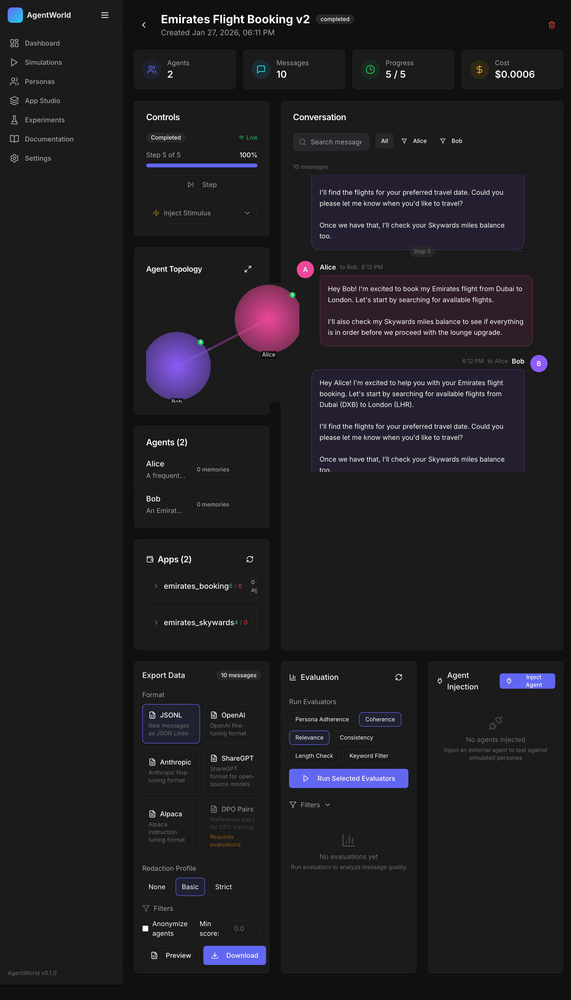

*Simulation detail view showing step controls, topology visualization, and conversation stream*

### Real-time WebSocket Updates

Live streaming of simulation events:

| Event Type | What Updates |
|------------|--------------|
| `message.sent` | New message in conversation |
| `state.changed` | App state modification |
| `agent.action` | Agent performed action |
| `simulation.status` | Running/paused/completed |
| `goal.achieved` | Goal condition met |

### Rate Limiting

Configurable throttling prevents API overload:
- Per-agent rate limits
- Global simulation rate limits
- Automatic backoff on provider errors

---

# Part 3: Agent System

> Personas, memory, topology, and LLM support

## 3.1 Persona System

### Big Five Trait Dimensions

Each agent has continuous trait values (0.0-1.0):

| Trait | What It Influences | Low (0.0) | High (1.0) |
|-------|-------------------|-----------|------------|
| **Openness** | Creativity, curiosity | Conventional, practical | Creative, curious |
| **Conscientiousness** | Organization, dependability | Flexible, spontaneous | Organized, disciplined |
| **Extraversion** | Sociability, assertiveness | Reserved, solitary | Outgoing, energetic |
| **Agreeableness** | Cooperation, trust | Competitive, skeptical | Cooperative, trusting |
| **Neuroticism** | Emotional instability | Calm, resilient | Anxious, reactive |

### 5 Preset Archetypes

Start quickly with pre-configured personalities:

| Archetype | Trait Profile | Best For |
|-----------|--------------|----------|
| **creative_innovator** | High openness (0.9), moderate extraversion (0.6) | Brainstorming, ideation |
| **analytical_thinker** | High conscientiousness (0.85), low neuroticism (0.2) | Technical review, analysis |
| **cautious_skeptic** | High neuroticism (0.7), low agreeableness (0.3) | Risk assessment, edge cases |
| **social_connector** | High extraversion (0.9), high agreeableness (0.85) | Facilitation, coordination |
| **detail_oriented** | High conscientiousness (0.95), low openness (0.3) | Compliance, documentation |

### Role System

Three roles shape agent behavior beyond personality:

| Role | Behavior Pattern | Example Use |
|------|-----------------|-------------|
| **service_agent** | Professional, direct, task-focused | Customer service agent |
| **customer** | Follows instructions, goal-oriented | End user simulation |
| **peer** | Natural conversation, trait-driven | Focus group participant |

Role-specific prompt adjustments ensure agents behave appropriately for their context.

### Advanced Persona Features

| Feature | Description |
|---------|-------------|
| **Custom Trait Extensions** | Add domain-specific traits beyond Big Five |
| **Population Generation** | Create diverse populations with Gaussian distribution |
| **Persona Collections** | Group and organize personas for reuse |
| **Radar Chart Visualization** | Visual trait display in agent inspector |
| **PersonaProfile** | Demographics: age, occupation, background |


*Persona library with search and grid/list view toggle*

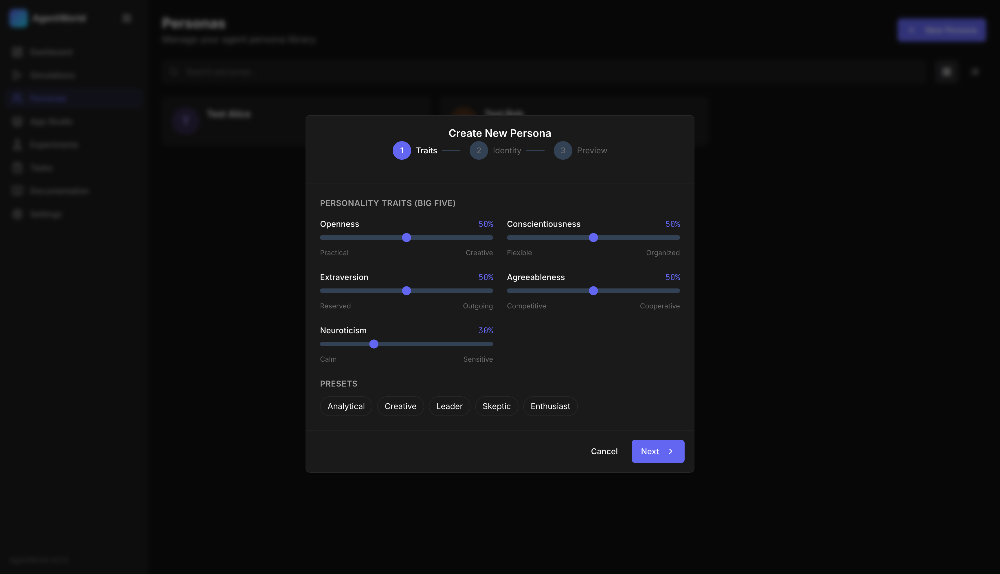

*Create personas with Big Five trait sliders and preset archetypes*

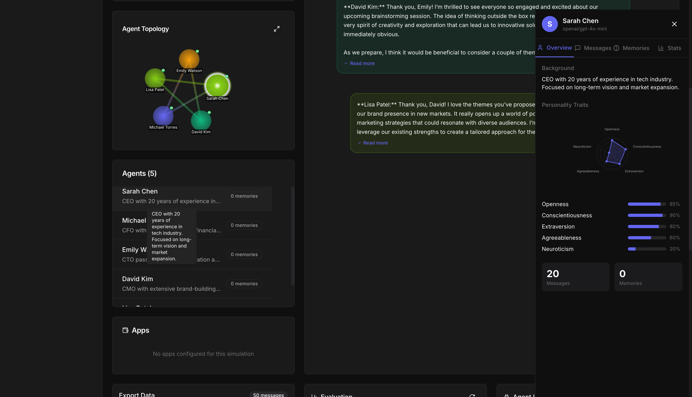

*Agent inspector showing Big Five radar chart and personality traits*

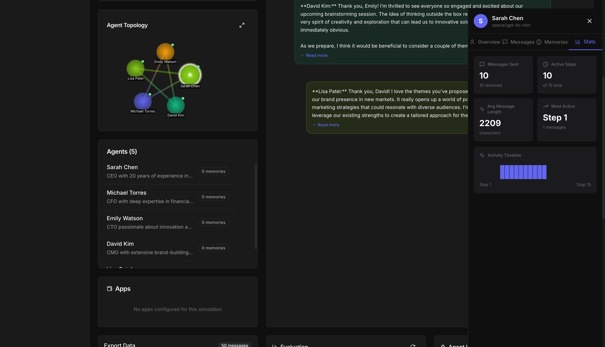

*Agent activity timeline and message statistics*

---

## 3.2 Memory & Learning

Based on Stanford's Generative Agents architecture.

### Dual Memory System

| Memory Type | Purpose | Default Limit |
|-------------|---------|---------------|
| **Episodic (Observations)** | Raw experiences from conversations | 1,000 entries |
| **Semantic (Reflections)** | Higher-level abstractions | 100 entries |

### Weighted Retrieval Formula

Memories are retrieved using a scoring function:

```
Score = α × Relevance + β × Recency + γ × Importance

Where:
- Relevance: Cosine similarity to current context
- Recency: Exponential decay since creation
- Importance: Scored value (1-10) normalized
```

### Importance Scoring

| Method | Speed | Accuracy | Use Case |
|--------|-------|----------|----------|
| **LLM-Based** | Slower | Higher | Production, critical conversations |
| **Fast Heuristic** | Instant | Good | Development, high-volume scenarios |

Fast heuristic uses keyword detection (emotions, decisions, names) for instant estimation.

### Memory Retention Policies

| Policy | Behavior | Best For |
|--------|----------|----------|
| **Importance-Weighted** | Keep highest importance | Quality over quantity |
| **FIFO** | Remove oldest first | Recency-focused |
| **Recency-Decay** | Weighted by time | Natural forgetting |

### Reflection Generation

Reflections trigger when accumulated importance exceeds threshold (default: 150):

```
Observations: "User asked about refund" (importance: 7)
              "User mentioned they're a long-time customer" (8)
              "User expressed frustration" (9)
              ...accumulated importance: 152

→ Triggers reflection: "This customer is frustrated and values
   their history with us. Prioritize empathy and resolution."
```

### Embedding Support

Multiple embedding models via LiteLLM:
- OpenAI text-embedding-3-small/large
- Sentence-Transformers (local)
- Cohere embed-v3
- Custom embedding endpoints

---

## 3.3 Network Topologies

First-class support for communication constraints—a unique AgentWorld differentiator.

### 5 Topology Types

| Topology | Structure | Use Case |
|----------|-----------|----------|
| **Mesh** | All-to-all connections | Focus groups, open discussions |
| **Hub-Spoke** | Central node connects to all | Customer service, moderated panels |
| **Hierarchical** | Tree structure with levels | Corporate structures, approvals |
| **Small-World** | Clustered with shortcuts | Social networks, viral spread |
| **Scale-Free** | Power-law degree distribution | Influencer networks, markets |

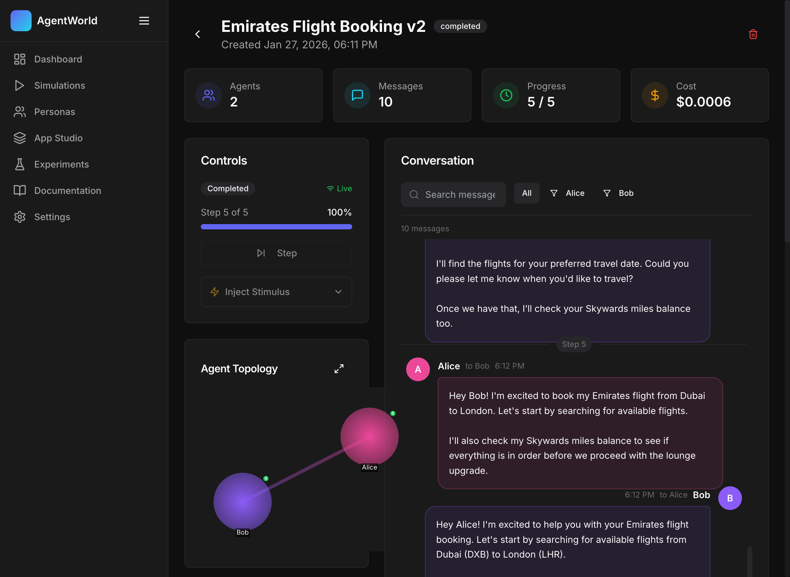

*Force-directed network topology showing agents and communication connections*

### NetworkX Integration

Full graph analysis capabilities:

| Metric | Description | Use |
|--------|-------------|-----|
| **Degree Centrality** | Number of direct connections | Identify well-connected agents |
| **Betweenness Centrality** | Bridge between groups | Find information bottlenecks |
| **Closeness Centrality** | Average distance to others | Identify efficient spreaders |
| **Eigenvector Centrality** | Connected to important nodes | Find influencers |

### Routing Modes

| Mode | Behavior |
|------|----------|
| **Direct-Only** | Messages only to directly connected agents |
| **Multi-Hop** | Messages can route through intermediaries |
| **Broadcast** | Messages to all reachable agents |

### Graph Safety

Automatic handling of:
- Disconnected graphs (isolated agents warned)
- Self-loops prevention
- Duplicate edge detection

---

## 3.4 Multi-LLM Support

Via LiteLLM integration, AgentWorld supports 100+ models.

### Supported Providers

| Provider | Example Models | Notes |
|----------|---------------|-------|
| **OpenAI** | GPT-4o, GPT-4-turbo | Production-grade |
| **Anthropic** | Claude 3.5 Sonnet, Opus | Strong reasoning |
| **Google** | Gemini Pro, Flash | Cost-effective |
| **Ollama** | Llama 3, Mistral | Local/on-premise |
| **Azure OpenAI** | All OpenAI models | Enterprise compliance |
| **AWS Bedrock** | Claude, Titan | AWS integration |

### LLM Features

| Feature | Description |
|---------|-------------|
| **Token Counting** | TikToken integration for accurate tracking |
| **Cost Estimation** | Per-model pricing tables |
| **Response Caching** | TTL + LRU eviction for efficiency |
| **Provider Fallback** | Automatic failover between providers |
| **Deterministic Mode** | Seeded execution for reproducibility |

### Response Caching

Development efficiency through intelligent caching:

| Setting | Purpose |
|---------|---------|
| **TTL (Time-To-Live)** | Configurable expiration |
| **LRU Eviction** | Automatic cleanup when full |
| **Cache Bypass** | Force fresh responses |

---

# Part 4: Creation Workflows

> Simulation and task creation with AI-assisted generation

## 4.1 Simulation Creation Wizard

### Template-Based Creation

Start from pre-built templates:

| Template | Description | Included |
|----------|-------------|----------|
| Focus Group | Multiple agents discussing topics | 5 diverse personas |
| Customer Service | Agent helping customers | Service agent + customers |
| Negotiation | Multi-party negotiation | Competing personas |
| Blank | Start from scratch | Empty configuration |

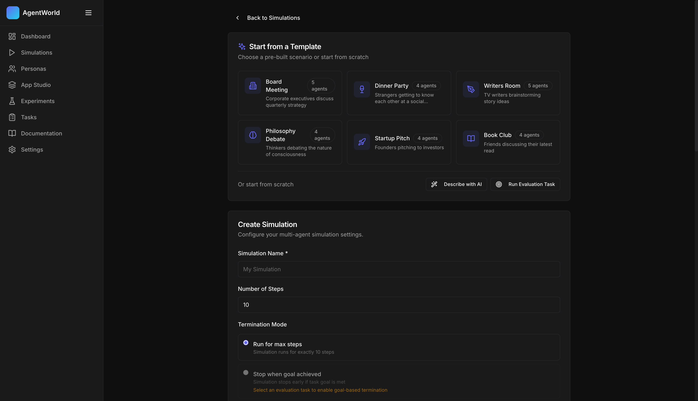

*Simulation template selection with Focus Group, Customer Service, and other templates*

### AI-Assisted Simulation Generation

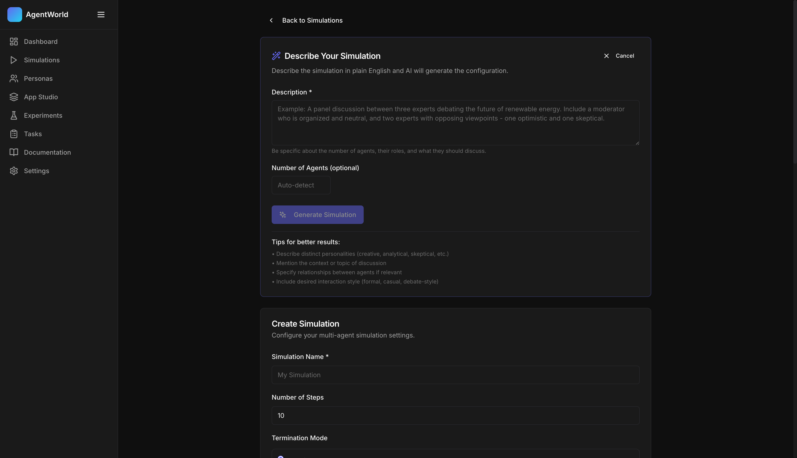

*Describe your scenario in natural language and AI generates the complete configuration*

Describe your simulation in natural language, AI generates the configuration:

**Input:**
```
"Board meeting with 4 executives discussing Q4 budget allocation.
 Include a skeptical CFO and an optimistic VP of Sales."
```

**Generated Output:**
- Simulation name: "Q4 Budget Board Meeting"
- 4 agents with appropriate roles
- CFO with high neuroticism, low agreeableness
- VP Sales with high extraversion, high openness
- Opening prompt to start discussion
- Recommended step count

### What Gets Generated

| Component | AI Generation |
|-----------|---------------|
| **Simulation name** | Descriptive title |
| **Description** | Scenario context |
| **Initial prompt** | Conversation starter |
| **Step count** | Recommended based on complexity |
| **Agents** | Names, roles, backgrounds, traits |

### Trait Assignment Logic

AI assigns traits contextually:
- Executives get higher conscientiousness
- Skeptics get higher neuroticism, lower agreeableness
- Diversity maintained (not all same traits)
- Role-appropriate assignments

---

## 4.2 Task Creation Wizard

A 4-step wizard for creating evaluation tasks with AI assistance.

### AI-Assisted Task Generation

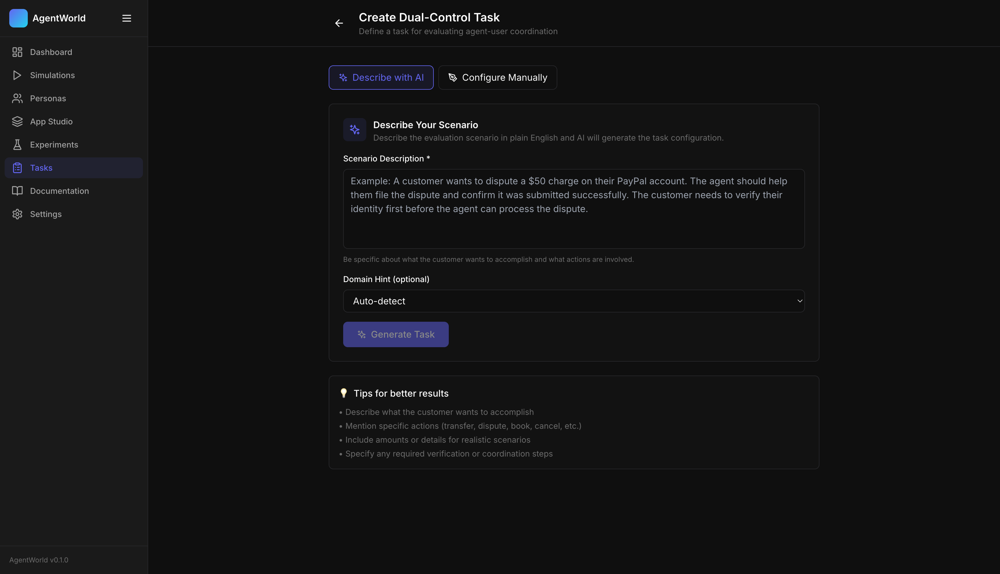

*Natural language task description with domain hints for optimized generation*

Describe your task in natural language:

**Input:**
```
"Customer wants to dispute a $50 charge on PayPal that they
 don't recognize. The agent should verify identity first."
```

**Generated Output:**
- Task name and description
- Domain: `paypal`
- Difficulty: `medium`
- Agent instructions
- User instructions
- Required handoffs with detection templates
- Goal conditions (all 4 types)
- Initial state configuration

### Domain Hints

Provide optional domain hints for better generation:

| Domain | Example Scenarios |
|--------|------------------|
| `paypal` | Transfers, disputes, refunds |
| `emirates` | Bookings, rebookings, cancellations |
| `banking` | Accounts, transactions, loans |
| `shopping` | Orders, returns, tracking |
| `telecom` | Plans, billing, support |
| `general` | Any domain |

### Step 1: Task Info

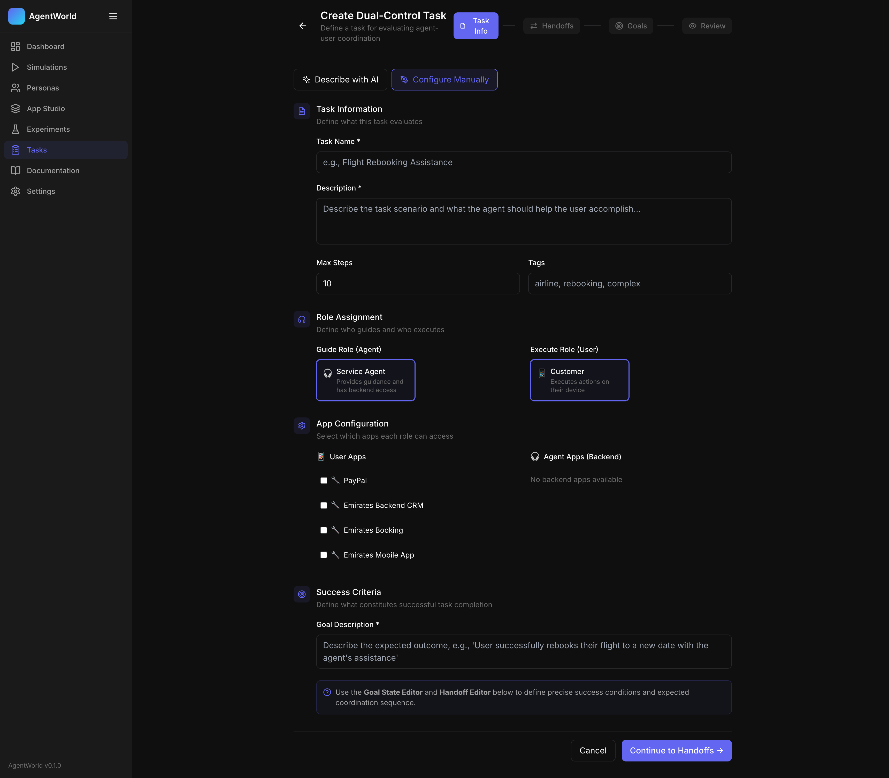

*Configure task metadata, instructions, and role assignments*

Configure basic task information:

| Field | Description |
|-------|-------------|
| **Name** | Task identifier |
| **Description** | What the task tests |
| **Domain** | Domain classification |
| **Difficulty** | easy / medium / hard |
| **Agent Instructions** | What the agent should do |
| **User Instructions** | What the simulated user does |

### Step 2: Handoff Sequence

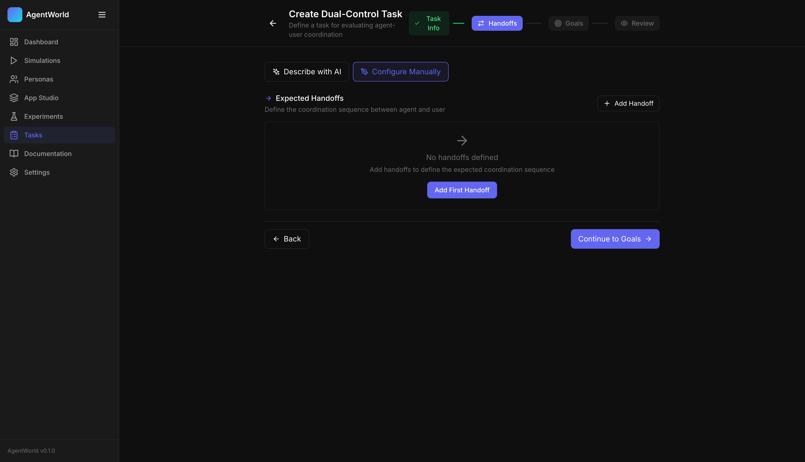

*Define the expected coordination sequence with app and action selection*

Define the expected coordination sequence:

| Field | Description |
|-------|-------------|
| **App** | Which app handles this handoff |
| **Action** | Expected action (from app's action list) |
| **Instruction Template** | Keywords for detection |
| **Order** | Sequence position |

**Instruction Template Example:**
```json
{
  "template_id": "verify_identity",
  "keywords": ["verify", "confirm", "authenticate"],
  "target_keywords": ["identity", "ID", "yourself"]
}
```

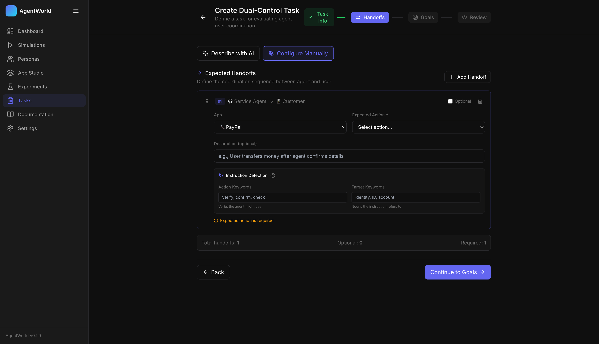

*Instruction detection keywords for automatic handoff matching*

Detects phrases like: "Please verify your identity" or "Can you confirm your ID?"

### Step 3: Goal Conditions

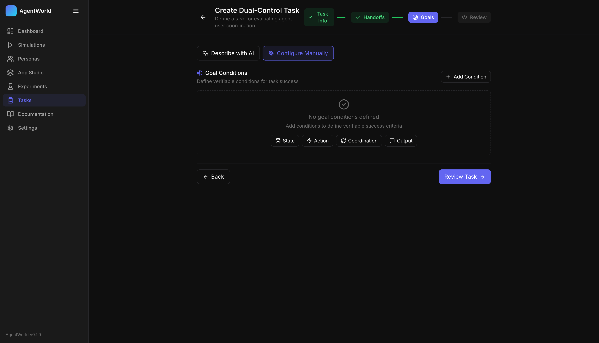

*Define success criteria using 4 goal types with visual color coding*

Define success criteria using 4 goal types:

| Type | Color | Description | Example |
|------|-------|-------------|---------|
| **State** | Blue | Field equals value | `paypal.balance == 150` |
| **Action** | Amber | Action was executed | `transfer` called with params |
| **Coordination** | Purple | Handoff completed | `verify_identity` success |
| **Output** | Green | Response contains phrase | `"confirmed"` in response |

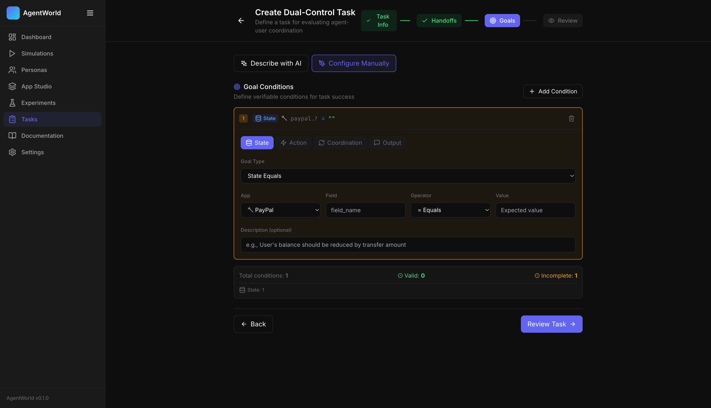

*Four goal types: State (blue), Action (amber), Coordination (purple), Output (green)*

**Goal Operators:**
- `equals`, `not_equals`
- `exists`, `not_exists`
- `greater_than`, `less_than`
- `contains`

### Step 4: Review

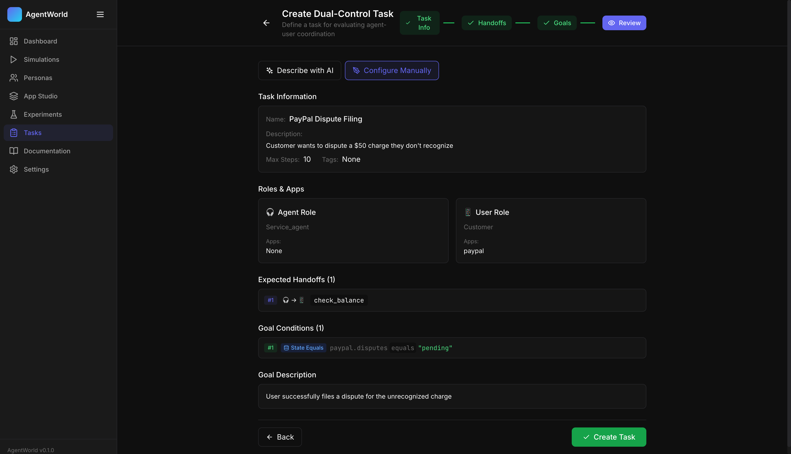

*Review complete configuration before submission*

Review complete configuration before submission:
- All fields displayed
- Edit capability for any section
- Validation warnings shown
- One-click submit

---

## 4.3 App-Aware Recommendations

AI generation is aware of available apps from App Studio.

### How It Works

1. AI reads your App Studio library
2. Matches task requirements to available apps
3. Recommends specific `app_id` for each handoff
4. Suggests actions from app's action list

### Example Recommendation

For a dispute task, AI might recommend:

```yaml
handoffs:
  - app_id: "paypal_v1"
    action: "get_account_info"
    purpose: "Verify user identity"

  - app_id: "paypal_v1"
    action: "get_transaction_history"
    purpose: "Find disputed transaction"

  - app_id: "paypal_v1"
    action: "file_dispute"
    purpose: "Submit dispute"
```

---

# Part 5: Evaluation Framework

> τ-bench, τ²-bench, coordination tracking, and metrics

## 5.1 τ-bench: Solo Agent Evaluation

Research-grade reliability measurement based on Sierra Research's τ-bench.

### pass^k Metric Explained

```
pass^k = P(at least one success in k attempts)
       = 1 - (1 - p)^k

Where p = base success probability
```

### Why pass^k Matters

| pass^1 | pass^8 | Assessment |
|--------|--------|------------|
| 90% | 57% | High variability—unreliable at scale |
| 90% | 99% | Consistent—production-ready |

A 90% success rate sounds good, but deploying 8 instances gives 57% chance of at least one failure. pass^k reveals hidden reliability issues.

### 17 Built-In Tasks

| Domain | Tasks | Examples |
|--------|-------|----------|
| **Payment** | 8 | Transfer, dispute, refund |
| **Shopping** | 9 | Order, return, tracking |

### Goal State Verification

| Verification Type | Description |
|------------------|-------------|
| **Exact Match** | Critical fields must match exactly |
| **Fuzzy Match** | Text content with similarity threshold |
| **Partial Credit** | Partial success scoring |
| **Mismatch Report** | Detailed diff of expected vs actual |

---

## 5.2 τ²-bench: Dual-Control Evaluation

Measures agent performance when coordinating with users—not just completing tasks alone.

### What is Dual-Control?

In dual-control scenarios:
- **Agent** gives instructions (can't access apps directly)
- **User** performs actions (has app access)
- Agent guides user remotely to complete task

```
┌─────────────┐     Instructions      ┌─────────────┐
│   Agent     │ ──────────────────▶  │    User     │
│ (no apps)   │                      │ (has apps)  │
│             │ ◀──────────────────  │             │
└─────────────┘     Confirmations     └─────────────┘
                                            │
                                            ▼
                                      ┌─────────────┐
                                      │    Apps     │
                                      └─────────────┘
```

### Key Research Finding

> Agents perform ~25 points worse when guiding users vs acting directly.

This performance drop reveals coordination ability—critical for real-world deployments where agents can't directly access user systems.

### Coordination Tracking Metrics

| Metric | Description |
|--------|-------------|
| `total_handoffs_required` | Required coordination points |
| `handoffs_completed` | Successfully completed |
| `coordination_success_rate` | Percentage (0-1) |
| `avg_instruction_to_action_turns` | Latency measure |
| `unnecessary_user_actions` | Extra actions taken |
| `user_confusion_count` | Confusion signals detected |

### Handoff Detection System

#### Instruction Templates

```json
{
  "template_id": "verify_identity",
  "keywords": ["verify", "confirm", "authenticate"],
  "target_keywords": ["identity", "ID", "yourself"]
}
```

#### Detection Pipeline

1. **Keyword Matching**: Action + target keyword detection
2. **Semantic Fallback**: Embedding similarity when keywords miss
3. **Action Correlation**: Match user action to expected action

### Solo vs Dual Comparison

Run the same task in both modes to quantify coordination overhead:

| Metric | Solo | Dual | Delta |
|--------|------|------|-------|
| pass^1 | 85% | 62% | -23% |
| Avg Steps | 4.2 | 7.8 | +3.6 |
| Cost | $0.05 | $0.12 | +140% |

### Goal Taxonomy (4 Types)

| Type | Badge Color | Description | Example |
|------|-------------|-------------|---------|
| **State** | 🔵 Blue | Field equals value | `paypal.balance == 150` |
| **Action** | 🟡 Amber | Action was executed | `transfer` with params |
| **Coordination** | 🟣 Purple | Handoff completed | `verify_identity` success |
| **Output** | 🟢 Green | Response contains | `"confirmed"` in response |

#### Goal Operators

| Operator | Usage |
|----------|-------|
| `equals` | Exact value match |
| `not_equals` | Value doesn't match |
| `exists` | Field/property exists |
| `not_exists` | Field/property absent |
| `greater_than` | Numeric comparison |
| `less_than` | Numeric comparison |
| `contains` | String/array contains |

---

## 5.3 Fault Classification

Systematic error diagnosis with **3 assignments × 18+ fault types**.

### Fault Assignments

| Assignment | Meaning |
|------------|---------|
| **Agent Fault** | Agent made incorrect decision |
| **Environment Fault** | App/system behaved unexpectedly |
| **Task Fault** | Task specification was ambiguous |

### Fault Types (Sample)

| # | Fault Type | Description |
|---|------------|-------------|
| 1 | Wrong action selected | Agent chose incorrect action |
| 2 | Missing required action | Agent skipped necessary step |
| 3 | Incorrect parameter value | Wrong value passed to action |
| 4 | Premature termination | Ended before task complete |
| 5 | Infinite loop/repetition | Stuck in repeated behavior |
| 6 | Policy violation | Broke business rules |
| 7 | State misread | Misinterpreted app state |
| 8 | Context confusion | Lost track of conversation |
| 9 | Timeout exceeded | Took too long |
| 10 | Unhandled exception | Crashed on error |
| 11 | Memory retrieval failure | Couldn't find relevant memory |
| 12 | Tool call format error | Malformed action call |
| 13 | Permission denied | Attempted unauthorized action |
| 14 | Rate limit exceeded | Hit API limits |
| 15 | Hallucinated action | Called non-existent action |
| 16 | Incomplete response | Partial or truncated output |
| 17 | Circular dependency | Logic loop in reasoning |
| 18 | Resource exhaustion | Ran out of tokens/budget |

---

## 5.4 Policy Engine

Rule-based compliance verification.

### Policy Definition

```yaml
policies:
  - name: "transfer_limit"
    condition: "action.name == 'transfer' AND action.amount > 5000"
    action: "require_approval"

  - name: "pii_protection"
    condition: "response.contains_pii == true"
    action: "redact_and_log"

  - name: "refund_limit"
    condition: "action.name == 'refund' AND action.amount > 1000"
    action: "escalate"
```

### Policy Actions

| Action | Behavior |
|--------|----------|
| `allow` | Permit the action |
| `deny` | Block the action |
| `require_approval` | Flag for human review |
| `escalate` | Route to supervisor |
| `redact_and_log` | Sanitize and record |

### Condition DSL

Flexible expression language supporting:
- Boolean operators: `AND`, `OR`, `NOT`
- Comparisons: `==`, `!=`, `>`, `<`, `>=`, `<=`
- String operations: `contains`, `startswith`, `endswith`
- Null checks: `is_null`, `is_not_null`

---

## 5.5 A/B Testing

Built-in statistical comparison framework.

### Variant Definition

```yaml
ab_test:
  name: "prompt_comparison"
  variants:
    - id: "control"
      prompt_template: "standard_v1"
    - id: "treatment"
      prompt_template: "empathetic_v2"
  allocation: 50/50
```

### Statistical Analysis

| Metric | Description |
|--------|-------------|
| **Success Rate** | Pass/fail per variant |
| **Confidence Interval** | Statistical bounds |
| **P-Value** | Significance testing |
| **Cohen's d** | Effect size for practical significance |

### Significance Thresholds

| P-Value | Interpretation |
|---------|----------------|
| < 0.01 | Strong evidence |
| < 0.05 | Moderate evidence |
| < 0.10 | Weak evidence |
| ≥ 0.10 | No significant difference |

---

## 5.6 LLM-Based Validators

Quality assessment using LLM judges.

| Validator | What It Checks |
|-----------|----------------|
| **Persona Adherence** | Does agent stay in character? |
| **Coherence** | Are responses logically consistent? |
| **Consistency** | Are facts maintained across turns? |
| **Relevance** | Does response address the query? |

### Sampling Rate Control

Run expensive validators on a subset to manage costs:

```yaml
validators:
  persona_adherence:
    enabled: true
    sample_rate: 0.1  # 10% of interactions
```

---

# Part 6: App Studio

> No-code app creation with visual logic builder

## 6.1 No-Code App Creation

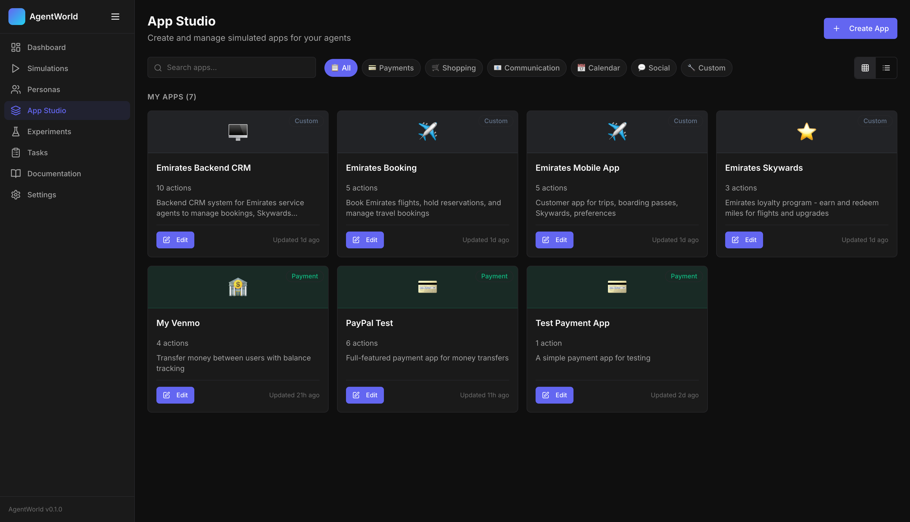

*App Studio library with grid view, search, and category filtering*

### 6 Starter Templates

| Template | Actions | Description |
|----------|---------|-------------|
| **Payment App** | 4 | Transfers, balances, history |
| **Shopping App** | 5 | Cart, checkout, orders |
| **Email App** | 4 | Send, read, search |
| **Calendar App** | 4 | Events, scheduling |
| **Messaging App** | 3 | Chat, notifications |
| **Blank App** | 0 | Start from scratch |

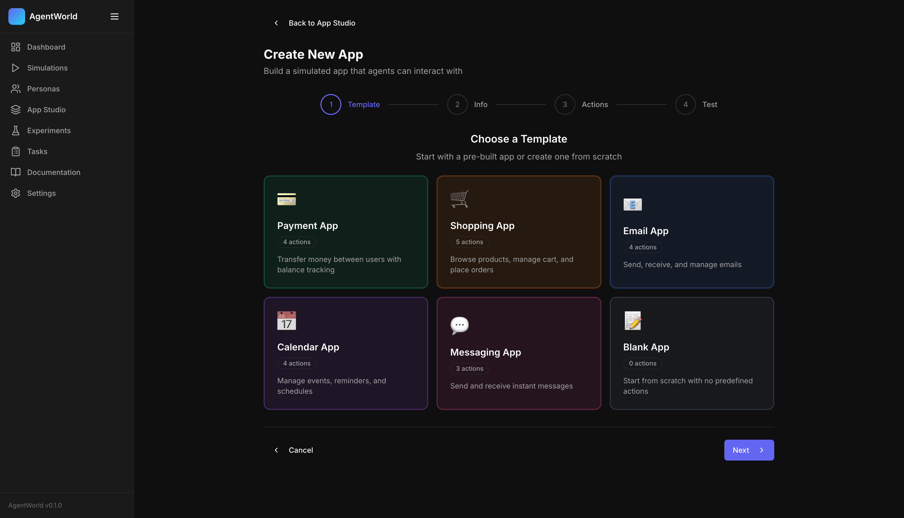

*Template cards showing action counts and descriptions*

### 4-Step Wizard

| Step | Configure |
|------|-----------|
| **1. Template** | Choose starting point |
| **2. App Info** | Name, category, icon, description |
| **3. Actions** | Define available operations |
| **4. Test** | Validate in sandbox |

---

## 6.2 JSON-Defined Apps

Create sophisticated apps without Python code.

### App Definition Schema

```yaml
name: "TicketSupport"
description: "Customer support ticket system"
version: "1.0.0"
access_type: SHARED
state_type: shared

state_schema:
  tickets:
    type: array
    items:
      type: object
      properties:
        id: { type: string }
        subject: { type: string }
        status: { type: string }

actions:
  - name: create_ticket
    type: WRITE
    description: "Create a new support ticket"
    parameters:
      subject:
        type: string
        required: true
      priority:
        type: string
        enum: [low, medium, high]
        default: medium
```

### State Schema Editor

Define fields with types and defaults:

| Type | Description | Example |
|------|-------------|---------|
| `string` | Text values | Names, IDs |
| `number` | Numeric values | Amounts, counts |
| `boolean` | True/false | Flags |
| `array` | Lists | Items, history |
| `object` | Nested structure | Complex data |

---

## 6.3 Visual Logic Builder

Define app behavior with 7 declarative directives.

### 7 Directive Types

| Directive | Purpose | Example |
|-----------|---------|---------|
| **VALIDATE** | Check preconditions | `VALIDATE: "amount > 0"` |
| **UPDATE** | Modify state | `UPDATE: "user.balance -= amount"` |
| **NOTIFY** | Send notifications | `NOTIFY: "Transfer complete"` |
| **RETURN** | Return values | `RETURN: "{ success: true }"` |
| **ERROR** | Return errors | `ERROR: "Insufficient funds"` |
| **BRANCH** | Conditional logic | `BRANCH: "amount > 1000"` |
| **LOOP** | Iteration | `LOOP: "items"` |

### Example: Transfer Action Logic

```yaml
logic:
  - VALIDATE: "amount > 0"
  - VALIDATE: "sender.balance >= amount"
  - BRANCH:
      condition: "amount > 5000"
      then:
        - RETURN: "{ requires_approval: true }"
      else:
        - UPDATE: "sender.balance -= amount"
        - UPDATE: "receiver.balance += amount"
        - NOTIFY: "Transfer of ${amount} complete"
        - RETURN: "{ success: true, new_balance: sender.balance }"
```

### Built-In Functions

| Function | Description | Example |
|----------|-------------|---------|
| `generate_id()` | Unique identifier | `"TKT-a1b2c3"` |
| `timestamp()` | Current ISO timestamp | `"2025-01-29T..."` |
| `random(min, max)` | Random number | `random(1, 100)` |
| `format_currency(n)` | Currency format | `"$1,234.56"` |
| `validate_email(s)` | Email validation | `true/false` |

### Loop Safeguards

Automatic protection against infinite loops:

| Protection | Limit |
|------------|-------|
| Max iterations | 1,000 |
| Timeout | 30 seconds |
| Circular reference detection | Automatic |

---

## 6.4 Test Sandbox

Test apps in isolation before using in simulations.

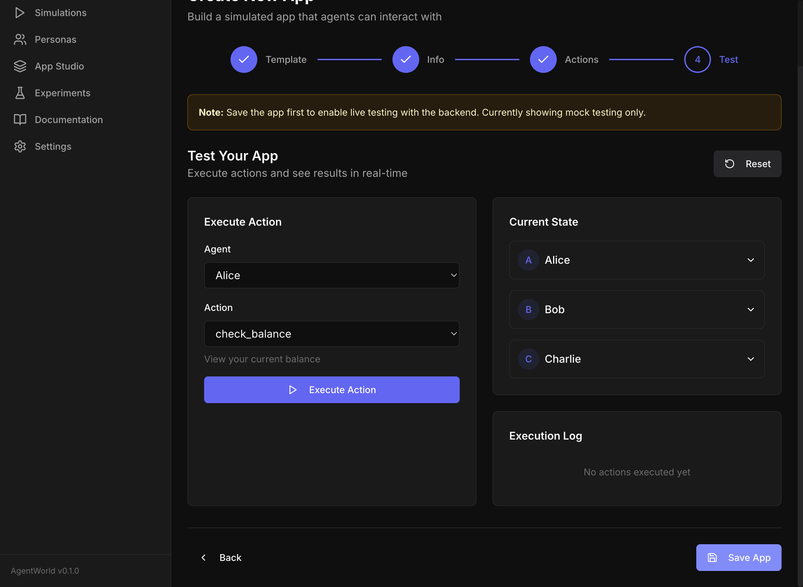

*Test sandbox showing action execution and state inspection*

### Sandbox Features

| Feature | Description |
|---------|-------------|
| **Execute Actions** | Call any action with parameters |
| **State Snapshots** | See before/after state |
| **Debug in Isolation** | No impact on simulations |
| **Error Feedback** | Validation errors, logic issues |
| **Reset State** | Return to initial state |

### Testing Workflow

1. Select action to test
2. Enter parameter values
3. Execute action
4. Inspect state changes
5. Review return value
6. Check for errors

---

## 6.5 Access Control

Three modes control who can access apps.

### 3 Access Modes

| Mode | Description | Use Case |
|------|-------------|----------|
| **SHARED** | All agents can access | Chat systems, shared DB |
| **ROLE_RESTRICTED** | Only specific roles | Admin tools, backend |
| **PER_AGENT** | Isolated per agent | Personal devices, accounts |

### State Isolation

| Type | Description | Example |
|------|-------------|---------|
| **Shared State** | Single state for all agents | Customer database |
| **Per-Agent State** | Isolated state per agent | Personal phone |

### Tool Type Annotations

| Type | Description | Implication |
|------|-------------|-------------|
| **READ** | Query-only operations | Safe to retry, cacheable |
| **WRITE** | State-modifying operations | Requires careful handling |

---

## 6.6 App Library Features

| Feature | Description |
|---------|-------------|
| **Grid/List Toggle** | View mode (preference persisted) |
| **Search** | Find by name, description, ID |
| **Category Filter** | payment, shopping, communication |
| **Duplicate** | One-click app duplication |
| **Export** | Download as JSON |
| **Delete** | Remove with confirmation |

---

# Part 7: Enterprise Features

> Agent injection, export pipelines, audit, and dashboard

## 7.1 Agent Injection

Connect external AI agents to AgentWorld simulations.

### What It Does

- Test production agents in controlled environment
- Compare internal vs external agent performance
- A/B test different agent implementations
- Validate before production deployment

### Configuration

```yaml
injected_agent:
  name: "ProductionAgent"
  endpoint: "https://api.company.com/agent"
  type: "http"  # or "websocket"
  auth:
    type: "bearer"
    token: "${AGENT_TOKEN}"
  timeout_ms: 30000
```

### Health Monitoring

| Metric | Description |
|--------|-------------|
| **Connection Status** | Real-time up/down |
| **Response Latency** | Average response time |
| **Success Rate** | Percentage of successful calls |
| **Token Usage** | Tokens consumed per call |
| **Error Rate** | Failed request percentage |

---

## 7.2 Data Export & Training Pipelines

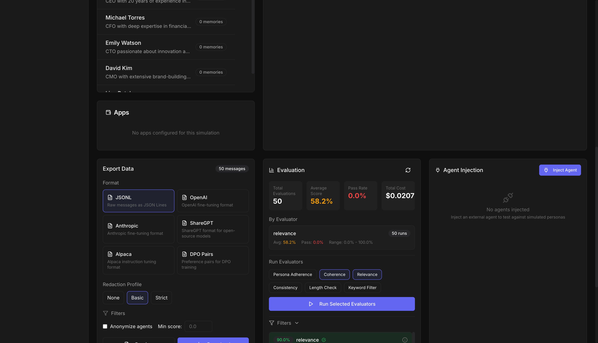

*Export panel with 6 formats, redaction profiles, and evaluation metrics*

### 6 Export Formats

| Format | Description | Use Case |
|--------|-------------|----------|
| **JSONL** | Raw JSON lines | Custom processing |
| **OpenAI** | Messages array | GPT fine-tuning |
| **Anthropic** | Human/Assistant turns | Claude fine-tuning |
| **ShareGPT** | Multi-turn conversations | Community sharing |
| **Alpaca** | Instruction-response pairs | SFT training |
| **DPO** | Chosen/rejected pairs | Preference optimization |

### DPO Pair Generation

Automatic generation of preference pairs for RLHF:

| Setting | Description |
|---------|-------------|
| **Score Threshold** | Minimum score difference for pairs |
| **Quality Filtering** | Min score for "chosen" responses |
| **Diversity Sampling** | Avoid redundant pairs |

### 3 Redaction Profiles

| Profile | What's Redacted |
|---------|-----------------|
| **None** | Nothing (internal use only) |
| **Basic** | API keys, credentials |
| **Strict** | All PII patterns detected |

### Agent Anonymization

Replace agent identifiers with generic labels:

```
Before: "Agent_John_Smith said..."
After:  "Agent_1 said..."
```

### Export Manifest

Each export includes:

| Field | Description |
|-------|-------------|
| **Version** | Export format version |
| **Timestamp** | Creation time |
| **Filters Applied** | What filters were used |
| **Record Count** | Number of records |
| **Integrity Hash** | SHA-256 for verification |

---

## 7.3 Reasoning Visibility & Audit

### 5 Visibility Levels

| Level | What's Captured | Use Case |
|-------|-----------------|----------|
| **NONE** | Nothing | Production, privacy-sensitive |
| **SUMMARY** | High-level decisions only | Standard monitoring |
| **DETAILED** | Decisions + key reasoning | Debugging |
| **FULL** | Complete reasoning traces | Development |
| **DEBUG** | Everything including internals | Deep debugging |

### Reasoning Trace Contents

| Component | Description |
|-----------|-------------|
| **Prompts** | Full prompts sent to LLM |
| **Completions** | Raw LLM responses |
| **Tool Calls** | Actions attempted and results |
| **Memory Retrievals** | Which memories influenced decision |
| **Timestamps** | Precise timing for each step |

### Privacy Redaction Patterns

| Pattern | Redaction |
|---------|-----------|
| API Keys | `[REDACTED_API_KEY]` |
| Emails | `[REDACTED_EMAIL]` |
| Phone Numbers | `[REDACTED_PHONE]` |
| Credit Cards | `[REDACTED_CC]` |
| SSN | `[REDACTED_SSN]` |

### Audit Trail

Complete action history with:
- Agent ID and name
- Action type and parameters
- Timestamp (ISO 8601)
- Result status
- State changes

---

## 7.4 Real-time Web Dashboard

### Dashboard Overview

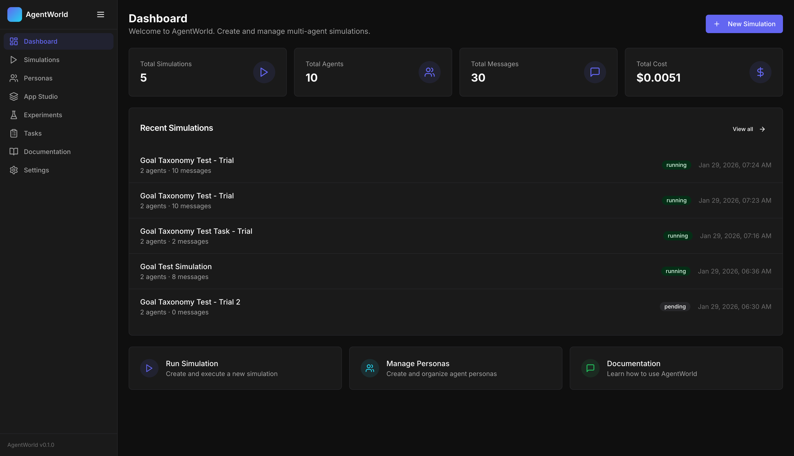

*Main dashboard showing metrics, recent simulations, and quick actions*

**Dashboard Components:**

| Component | Description |
|-----------|-------------|
| **Stats Cards** | Total simulations, agents, messages, cost |
| **Recent List** | Latest simulations with status |
| **Quick Actions** | Create simulation, view apps |
| **System Status** | API health indicators |

### Simulation Detail View

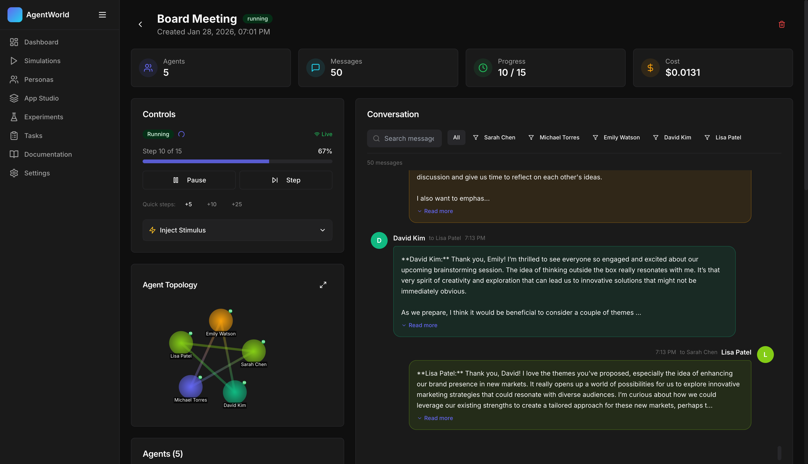

*Complete simulation view with controls, topology, conversation, and panels*

**Detail Components:**

| Component | Features |
|-----------|----------|
| **Controls Panel** | Play, pause, step (+1/+5/+10/+25) |
| **Topology Graph** | Force-directed D3.js visualization |
| **Conversation Stream** | Virtualized message list (1000+) |
| **Agent Inspector** | Detailed agent view on click |
| **Apps Panel** | App instances and action logs |
| **Stimulus Injector** | Manual message injection |
| **Coordination Panel** | Handoff metrics (dual-control) |

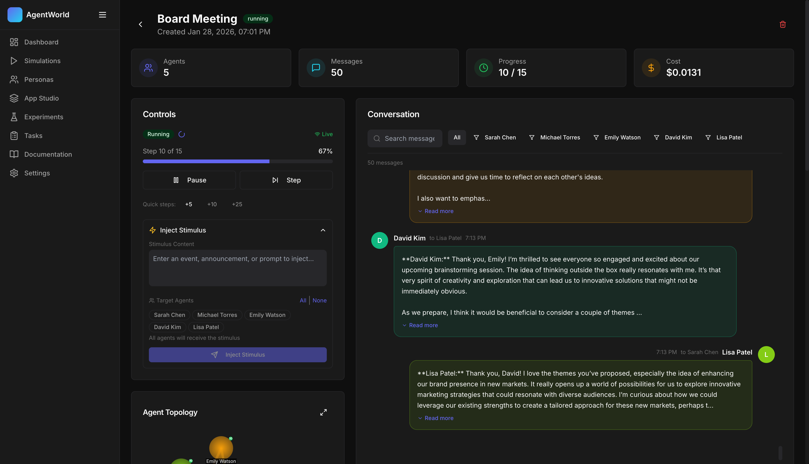

*Inject stimulus events with agent targeting for scenario control*

### Conversation Stream Features

| Feature | Description |
|---------|-------------|
| **Virtualization** | react-window for 1000+ messages |
| **Agent Filter Pills** | Scrollable agent filtering |
| **Search** | Find messages by content |
| **Step Dividers** | Visual separation between steps |
| **Auto-Scroll** | Follow latest messages |
| **Export** | Copy or download conversations |

### Agent Inspector

Access by clicking any agent:

| Tab | Contents |
|-----|----------|
| **Overview** | Persona, traits radar, stats |
| **Messages** | Agent's message history |
| **Memories** | Observations and reflections |
| **Stats** | Token usage, cost, actions |

---

# Part 8: Use Cases

## 8.1 PayPal: Payment & Dispute Scenarios

### Multi-Agent Payment Flows

```
Buyer Agent → Payment Gateway → Seller Agent
      ↓              ↓               ↓
  Wallet App    Compliance App   Inventory App
```

### Scenario Examples

| Scenario | Complexity | Key Metrics |
|----------|------------|-------------|
| Transfer money | Low | Success rate, time |
| File dispute | Medium | Resolution quality |
| Fraud detection | High | Detection accuracy |
| Multi-party escrow | High | State consistency |

### Evaluation Focus

- **Policy Compliance**: Every transfer follows limits
- **Multi-App Consistency**: State matches across apps
- **Rollback Handling**: Failed transactions reverse cleanly
- **Escalation Timing**: Complex cases route to humans

### Example Task: Dispute Filing

```yaml
task:
  name: "File Dispute for Unrecognized Charge"
  domain: paypal
  difficulty: medium

  agent_instructions: |
    You are a PayPal support agent. Help the customer
    file a dispute for a transaction they don't recognize.
    Verify identity before accessing account.

  handoffs:
    - action: verify_identity
      app: paypal
      instruction_template: ["verify", "identity"]

    - action: get_transaction_history
      app: paypal
      instruction_template: ["show", "transactions"]

    - action: file_dispute
      app: paypal
      instruction_template: ["file", "dispute"]

  goals:
    - type: state
      condition: "paypal.disputes[0].status == 'pending'"
    - type: action
      condition: "file_dispute executed"
    - type: coordination
      condition: "verify_identity handoff completed"
```

---

## 8.2 Emirates: Airline Customer Service

### Why Airlines Are Hard

τ-bench results show airlines are the hardest domain:

| Domain | GPT-4o pass^1 |
|--------|---------------|
| Retail | 50% |
| **Airlines** | 35.2% |

> If your agent handles airlines, it handles anything.

### Complexity Factors

- Interconnected systems (booking, loyalty, baggage)
- Strict policy compliance (fare rules, regulations)
- Time-sensitive operations (gates, connections)
- High emotional stakes (missed flights, lost bags)

### Scenario Examples

| Scenario | Complexity | Key Metrics |
|----------|------------|-------------|
| Seat selection | Low | Response accuracy |
| Rebooking | Medium | Policy compliance |
| Lost baggage | Medium | Empathy + resolution |
| Delay compensation | High | Legal accuracy |
| Medical emergency | High | Escalation timing |

### Disruption Management

Mass cancellation scenarios:

```yaml
scenario:
  name: "Mass Flight Cancellation"
  agents: 50  # Affected passengers

  agent_distribution:
    - archetype: detail_oriented
      count: 15
      # Focused on rebooking details

    - archetype: cautious_skeptic
      count: 10
      # Worried about compensation

    - archetype: social_connector
      count: 25
      # Concerned about reaching family

  constraints:
    - Alternative flights limited
    - Hotel vouchers capped at $200
    - Compensation rules vary by route
```

### Example Task: Flight Rebooking

```yaml
task:
  name: "Rebook Cancelled Flight"
  domain: emirates
  difficulty: hard

  initial_state:
    booking:
      flight: "EK503"
      status: "cancelled"
      passenger: "John Smith"
      loyalty_tier: "Gold"

  goals:
    - type: state
      condition: "booking.status == 'confirmed'"
    - type: state
      condition: "booking.seat_class == original_class"
    - type: action
      condition: "apply_loyalty_upgrade attempted if available"
    - type: coordination
      condition: "all required verifications completed"
```

---

# Appendix

## A. Technical Architecture

### High-Level Architecture

```
┌─────────────────────────────────────────────────────────────┐
│                      Web Dashboard                           │
│  React + TypeScript + D3.js + react-window                  │
└─────────────────────────────────────────────────────────────┘
                              │
              ┌───────────────┴───────────────┐
              │         API Layer             │
              │  FastAPI + WebSocket Events   │
              └───────────────┬───────────────┘
                              │
┌─────────────────────────────┴─────────────────────────────┐
│                       Core Engine                          │
│  ┌─────────────┐  ┌─────────────┐  ┌─────────────┐       │
│  │ Simulation  │  │   Agent     │  │    App      │       │
│  │   Runner    │  │   System    │  │  Framework  │       │
│  └─────────────┘  └─────────────┘  └─────────────┘       │
│  ┌─────────────┐  ┌─────────────┐  ┌─────────────┐       │
│  │  Topology   │  │ Evaluation  │  │   Export    │       │
│  │   Manager   │  │   Engine    │  │  Pipeline   │       │
│  └─────────────┘  └─────────────┘  └─────────────┘       │
└───────────────────────────┬───────────────────────────────┘
                            │
            ┌───────────────┴───────────────┐
            │      Persistence Layer        │
            │  SQLite + SQLAlchemy ORM      │
            └───────────────┬───────────────┘
                            │
            ┌───────────────┴───────────────┐
            │      LLM Provider Layer       │
            │  LiteLLM (100+ models)        │
            └───────────────────────────────┘
```

### Technology Stack

| Layer | Technology |
|-------|------------|
| **Frontend** | React, TypeScript |
| **Visualization** | D3.js, react-window |
| **API** | FastAPI |
| **Core** | Python 3.11+ |
| **Database** | SQLite + SQLAlchemy |
| **LLM** | LiteLLM |
| **Embeddings** | Sentence-Transformers |
| **Graphs** | NetworkX |
| **Tokens** | TikToken |

---

## B. API Reference Summary

### Key Endpoints

| Category | Endpoints |
|----------|-----------|
| **Simulations** | `GET/POST /simulations`, `POST /simulations/{id}/step`, `POST /simulations/{id}/inject` |
| **Agents** | `GET /agents`, `GET /agents/{id}/memories` |
| **Apps** | `GET/POST /apps`, `POST /apps/{id}/test` |
| **Tasks** | `GET/POST /dual-control-tasks`, `POST /dual-control-tasks/generate` |
| **Evaluation** | `GET /evaluations/{id}/metrics`, `GET /evaluations/{id}/coordination` |
| **Export** | `POST /export` |

### WebSocket Events

| Event | Payload |
|-------|---------|
| `simulation.started` | `{ simulation_id, timestamp }` |
| `message.sent` | `{ agent_id, content, step }` |
| `state.changed` | `{ app_id, changes }` |
| `goal.achieved` | `{ goal_id, type }` |
| `simulation.completed` | `{ simulation_id, final_state }` |

---

## C. Research Citations

### Primary Papers

1. **Park, J. S., et al.** (2023). *Generative Agents: Interactive Simulacra of Human Behavior*. UIST 2023 Best Paper. [arXiv:2304.03442](https://arxiv.org/abs/2304.03442)

2. **Yao, S., et al.** (2024). *τ-bench: A Benchmark for Tool-Agent-User Interaction in Real-World Domains*. [arXiv:2406.12045](https://arxiv.org/abs/2406.12045)

3. **Dong, Y., et al.** (2025). *τ²-bench: Benchmarking Conversational AI Agents in Two-Party Collaborative Tasks*. [arXiv:2506.07982](https://arxiv.org/abs/2506.07982)

4. **Microsoft Research** (2025). *TinyTroupe: LLM-powered multiagent persona simulation for imagination enhancement and business insights*. [arXiv:2507.09788](https://arxiv.org/abs/2507.09788)

5. **Li, G., et al.** (2023). *CAMEL: Communicative Agents for "Mind" Exploration of Large Language Model Society*. NeurIPS 2023. [arXiv:2303.17760](https://arxiv.org/abs/2303.17760)

6. **Trivedi, H., et al.** (2024). *AppWorld: A Controllable World of Apps and People for Benchmarking Interactive Coding Agents*. ACL 2024 Best Resource Paper. [arXiv:2407.18901](https://arxiv.org/abs/2407.18901)

7. **MultiAgentBench** (2025). *MultiAgentBench: Evaluating the Collaboration and Competition of LLM Agents*. [arXiv:2503.01935](https://arxiv.org/abs/2503.01935)

8. **Liu, X., et al.** (2024). *AgentBench: Evaluating LLMs as Agents*. ICLR 2024. [arXiv:2308.03688](https://arxiv.org/abs/2308.03688)

### Official Resources

| Resource | URL |
|----------|-----|
| τ-bench | github.com/sierra-research/tau-bench |
| τ²-bench | github.com/sierra-research/tau2-bench |
| TinyTroupe | github.com/microsoft/TinyTroupe |
| AppWorld | appworld.dev |
| Sierra Research | sierra.ai |

---

*AgentWorld Feature Showcase v2*
*Last updated: 2026-01-29*
