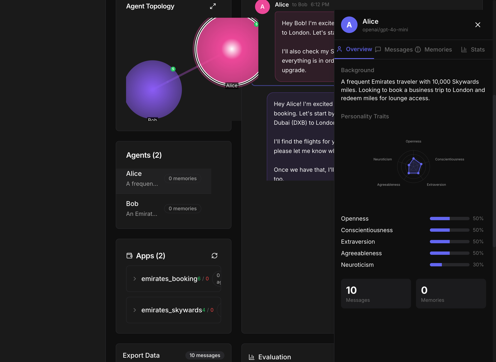
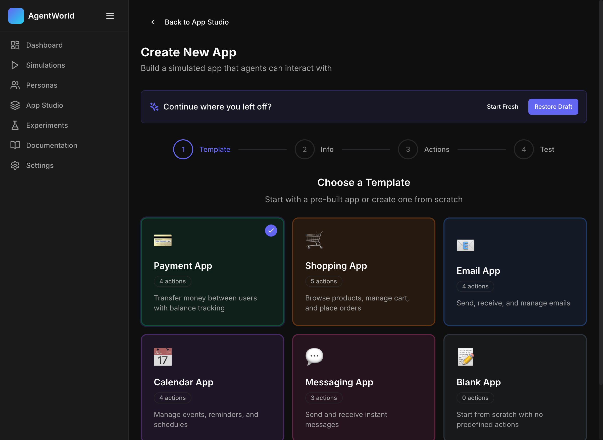
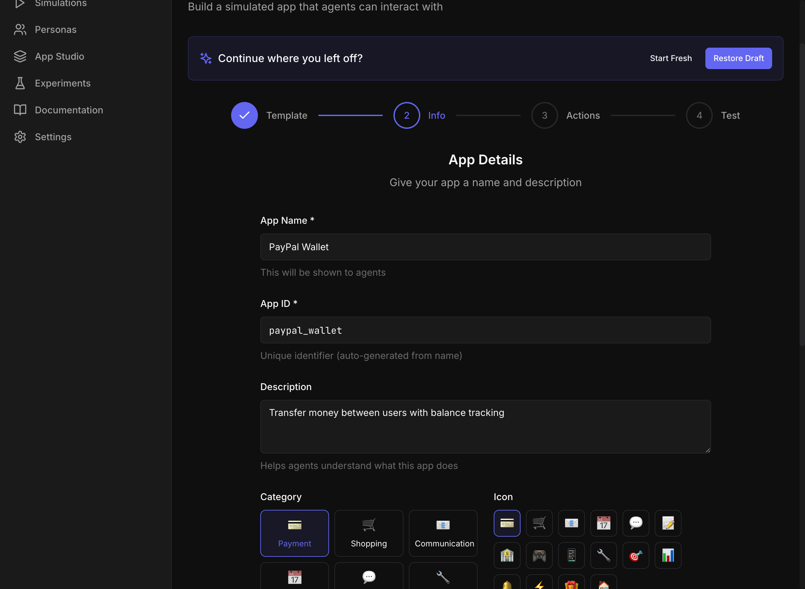
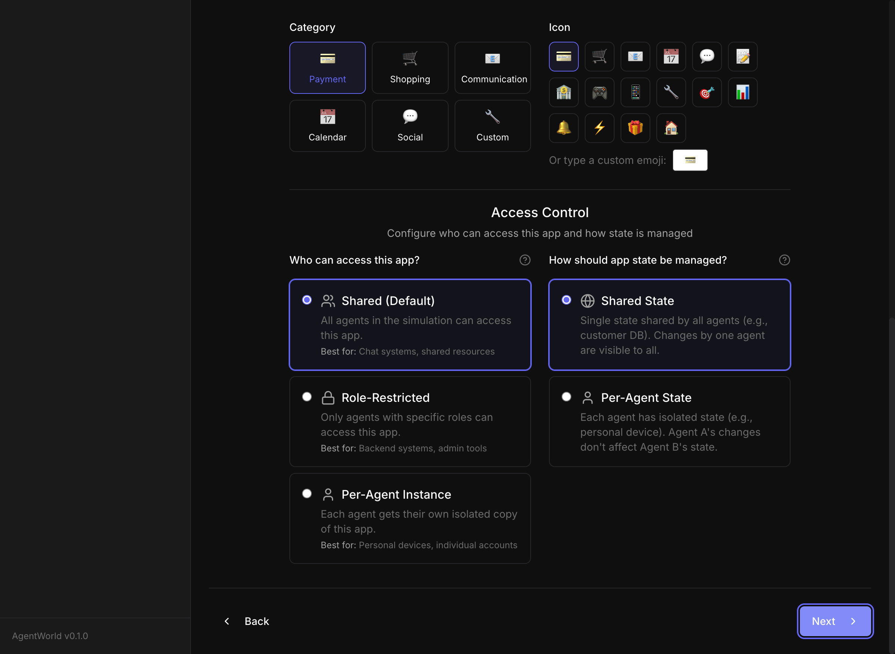
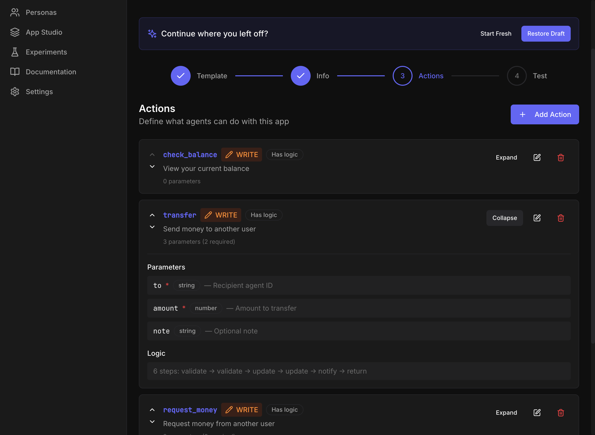

# AgentWorld Feature Showcase

> **A Research-Grade Multi-Agent Simulation Platform for Enterprise AI Applications**

---

---

## Table of Contents

1. [Executive Summary](#1-executive-summary)
2. [Research Lineage & Academic Foundations](#2-research-lineage--academic-foundations)
3. [Feature Catalog](#3-feature-catalog)
   - [3.1 Core Simulation Framework](#31-core-simulation-framework)
   - [3.2 App Framework & App Studio](#32-app-framework--app-studio)
   - [3.3 Evaluation Framework](#33-evaluation-framework)
   - [3.4 API & Integration Layer](#34-api--integration-layer)
   - [3.5 Web Dashboard](#35-web-dashboard)
4. [Value Proposition for Enterprise](#4-value-proposition-for-enterprise)
5. [Comparison with Industry Benchmarks](#5-comparison-with-industry-benchmarks)
6. [Technical Architecture](#6-technical-architecture)
7. [Implementation Status](#7-implementation-status)
8. [Appendices](#8-appendices)

---

## 1. Executive Summary

**AgentWorld** is a research-grade multi-agent simulation platform that enables enterprises to design, test, and evaluate AI agent systems at scale. Built on foundations from leading academic research—including Stanford's Generative Agents, Sierra Research's τ-bench evaluation framework, and Microsoft's TinyTroupe persona system—AgentWorld provides the only integrated solution combining true multi-agent support (N>2 agents), no-code app creation, and research-grade evaluation metrics.

### Key Value Propositions

- **Research-Grade Evaluation**: Implements τ-bench's pass^k reliability metrics for statistically rigorous agent performance measurement
- **Multi-Agent Orchestration**: Native support for complex N-agent scenarios with 5 network topology types
- **No-Code App Studio**: Business users can create simulated app environments without writing code
- **Enterprise Integration**: 100+ LLM models via LiteLLM, REST/WebSocket APIs, and 6 fine-tuning export formats
- **Persona Depth**: Big Five personality traits with memory-reflection-planning architecture for realistic agent behavior

### Capability Summary

| Category | Capabilities |
|----------|-------------|
| **Agents** | Big Five personas, dual memory (episodic + semantic), reflection-planning cycles |
| **Networks** | Mesh, hub-spoke, hierarchical, small-world, scale-free topologies |
| **Apps** | Dynamic JSON-defined apps, declarative logic language, simulated payment/service apps |
| **Evaluation** | pass^k metrics, state verification, fault classification, quality scoring |
| **Integration** | 30+ REST endpoints, WebSocket real-time events, 6 export formats |

---

## 2. Research Lineage & Academic Foundations

AgentWorld synthesizes best practices from leading multi-agent and evaluation research. This section documents the academic foundations and what AgentWorld adopts from each.

### 2.1 Core Research Foundations

| Framework/Paper | Venue | Key Contribution | What AgentWorld Adopts |
|-----------------|-------|------------------|------------------------|
| **Generative Agents** (Park et al.) | UIST 2023 Best Paper | Memory-reflection-planning architecture for believable agents | Dual memory system, importance scoring, reflection threshold triggers |
| **τ-bench** (Yao et al.) | arXiv:2406.12045 | pass^k reliability metrics for agent evaluation | Statistical evaluation framework, state verification, policy compliance |
| **τ²-bench** (Dong et al.) | arXiv:2506.07982 | Dual-control scenarios with human-in-the-loop | Dual-control concepts, Dec-POMDP modeling, access control patterns |
| **TinyTroupe** (Microsoft Research) | arXiv:2507.09788 | Big Five persona system for synthetic populations | Trait vector personas, personality-influenced response generation |
| **CAMEL** (Li et al.) | NeurIPS 2023 | Multi-provider LLM abstraction for role-playing | LiteLLM integration, unified completion interface, provider configuration |
| **AppWorld** (Trivedi et al.) | ACL 2024 Best Resource Paper | Interactive app environments for API evaluation | App definition schema, simulated app framework, state management |
| **MultiAgentBench** | arXiv:2503.01935 | Multi-agent collaboration protocols | Network topology constraints, agent communication protocols |
| **AgentBench** | ICLR 2024 | LLM-as-Agent evaluation patterns | Task-based evaluation, environment state tracking |

### 2.2 Key Positioning: Best-of-Breed Synthesis

AgentWorld uniquely combines capabilities that exist in isolation across different platforms:

```
                                AgentWorld    τ²-bench    AppWorld    TinyTroupe
Multi-Agent Support (N>2)           ✅           ❌          ❌           ✅
Dual-Control Scenarios              🟡           ✅          ❌           ❌
Dynamic App Creation (No-Code)      ✅           ❌          ❌           ❌
Research-Grade pass^k Metrics       ✅           ✅          ❌           ❌
Big Five Persona System             ✅           ❌          ❌           ✅
Memory-Reflection Architecture      ✅           ❌          ❌           ✅
Network Topology Constraints        ✅           ❌          ❌           ❌
API-Based App Environments          ✅           ❌          ✅           ❌
```

### 2.3 Academic References

#### Primary Papers

1. **Park, J. S., et al.** (2023). *Generative Agents: Interactive Simulacra of Human Behavior*. UIST 2023 Best Paper. [arXiv:2304.03442](https://arxiv.org/abs/2304.03442)

2. **Yao, S., et al.** (2024). *τ-bench: A Benchmark for Tool-Agent-User Interaction in Real-World Domains*. [arXiv:2406.12045](https://arxiv.org/abs/2406.12045)

3. **Dong, Y., et al.** (2025). *τ²-bench: Benchmarking Conversational AI Agents in Two-Party Collaborative Tasks*. [arXiv:2506.07982](https://arxiv.org/abs/2506.07982)

4. **Microsoft Research** (2025). *TinyTroupe: LLM-powered multiagent persona simulation for imagination enhancement and business insights*. [arXiv:2507.09788](https://arxiv.org/abs/2507.09788)

5. **Li, G., et al.** (2023). *CAMEL: Communicative Agents for "Mind" Exploration of Large Language Model Society*. NeurIPS 2023. [arXiv:2303.17760](https://arxiv.org/abs/2303.17760)

6. **Trivedi, H., et al.** (2024). *AppWorld: A Controllable World of Apps and People for Benchmarking Interactive Coding Agents*. ACL 2024 Best Resource Paper. [arXiv:2407.18901](https://arxiv.org/abs/2407.18901)

7. **MultiAgentBench** (2025). *MultiAgentBench: Evaluating the Collaboration and Competition of LLM Agents*. [arXiv:2503.01935](https://arxiv.org/abs/2503.01935)

8. **Liu, X., et al.** (2024). *AgentBench: Evaluating LLMs as Agents*. ICLR 2024. [arXiv:2308.03688](https://arxiv.org/abs/2308.03688)

#### Official Resources

- [τ-bench GitHub](https://github.com/sierra-research/tau-bench) - Sierra Research
- [τ²-bench GitHub](https://github.com/sierra-research/tau2-bench) - Sierra Research
- [AppWorld](https://appworld.dev/) - Official Website
- [TinyTroupe GitHub](https://github.com/microsoft/TinyTroupe) - Microsoft Research
- [CAMEL-AI](https://www.camel-ai.org/) - Official Website

---

## 3. Feature Catalog

### 3.1 Core Simulation Framework

#### Agent System (ADR-004)

AgentWorld's agent system implements the Big Five personality model with trait vectors that influence agent behavior across all interactions.

**Big Five Trait Dimensions:**
- **Openness** (0-1): Creativity, curiosity, openness to experience
- **Conscientiousness** (0-1): Organization, dependability, self-discipline
- **Extraversion** (0-1): Sociability, assertiveness, positive emotions
- **Agreeableness** (0-1): Cooperation, trust, helpfulness
- **Neuroticism** (0-1): Emotional instability, anxiety, moodiness

**Features:**
- Trait vectors with 0-1 normalized values
- Custom traits support beyond Big Five
- Trait-aware prompt generation
- Personality influences response style, word choice, and decision-making

**Example Persona Configuration:**
```yaml
agents:
  - name: "Sarah Chen"
    traits:
      openness: 0.85
      conscientiousness: 0.70
      extraversion: 0.45
      agreeableness: 0.80
      neuroticism: 0.30
    background: "Software engineer with 10 years experience"
```



*Agent inspector panel showing Big Five personality traits as a radar chart with trait percentages*

#### Memory Architecture (ADR-006)

Based on Stanford's Generative Agents, AgentWorld implements a dual memory system:

**Episodic Memory (Observations):**
- Stores raw experiences from conversations
- Timestamped with recency decay
- Importance scoring via LLM

**Semantic Memory (Reflections):**
- Higher-level abstractions generated from observations
- Triggered when accumulated importance exceeds threshold (default: 150)
- Enables long-term behavioral patterns

**Retrieval Function:**
```
Score = α × Recency + β × Importance + γ × Relevance

Where:
- Recency: Exponential decay based on time since memory creation
- Importance: LLM-assigned score (1-10) normalized
- Relevance: Cosine similarity of embeddings to current context
```

#### Network Topologies (ADR-005)

Five pre-built topology types for modeling communication constraints:

| Topology | Description | Use Case |
|----------|-------------|----------|
| **Mesh** | All-to-all communication | Focus groups, open discussions |
| **Hub-Spoke** | Central node connects to all | Customer service, moderated panels |
| **Hierarchical** | Tree structure with levels | Corporate structures, approvals |
| **Small-World** | Clustered with shortcuts | Social networks, viral spread |
| **Scale-Free** | Power-law degree distribution | Influencer networks, markets |


*Force-directed network topology showing agents and their communication connections*

**NetworkX Integration:**
- `get_neighbors(agent)`: Returns agents an agent can communicate with
- `can_communicate(a, b)`: Validates communication path exists
- Network metrics: clustering coefficient, centrality measures, path lengths

#### Multi-LLM Support (ADR-003)

Via LiteLLM integration, AgentWorld supports 100+ models:

| Provider | Models | Notes |
|----------|--------|-------|
| OpenAI | GPT-4o, GPT-4-turbo, GPT-3.5 | Production-grade |
| Anthropic | Claude 3.5 Sonnet, Claude 3 Opus | Strong reasoning |
| Google | Gemini Pro, Gemini Flash | Cost-effective |
| Ollama | Llama 3, Mistral, Phi-3 | Local/on-premise |
| Azure OpenAI | All OpenAI models | Enterprise compliance |
| AWS Bedrock | Claude, Titan | AWS integration |

**Features:**
- Unified completion interface across providers
- Automatic token counting and cost tracking
- Response caching for development efficiency
- Provider fallback chains

---

### 3.2 App Framework & App Studio

#### Simulated Apps (ADR-017)

Pre-built simulated applications for common enterprise scenarios:

**Payment Apps:**
- `PaymentApp`: Transfers, refunds, balance checks
- `DisputeApp`: Dispute filing and resolution
- `WalletApp`: Multi-currency wallet management

**Service Apps:**
- `AirlineApp`: Bookings, changes, cancellations
- `RetailApp`: Orders, returns, loyalty programs
- `BankingApp`: Account management, transactions

Each app provides:
- Stateful operations with ACID guarantees
- Realistic error conditions
- Policy enforcement (limits, restrictions)
- Audit trails

#### Dynamic App Engine (ADR-018)

Create custom apps via JSON definitions without code:

```json
{
  "name": "TicketSupport",
  "description": "Customer support ticket system",
  "version": "1.0.0",
  "state_schema": {
    "tickets": { "type": "array", "items": { "$ref": "#/definitions/Ticket" } }
  },
  "actions": [
    {
      "name": "create_ticket",
      "parameters": {
        "subject": { "type": "string" },
        "priority": { "type": "string", "enum": ["low", "medium", "high"] }
      },
      "returns": { "type": "object" }
    }
  ]
}
```

#### Logic Language (ADR-019)

Declarative business logic for app behavior:

**Directives:**
- `RETURN`: Return values from actions
- `MUTATE`: Modify app state
- `REQUIRE`: Validate preconditions
- `DENY_IF`: Reject operations conditionally
- `LOG`: Audit trail entries

**Example Logic:**
```yaml
actions:
  transfer_funds:
    logic:
      - REQUIRE: "user.balance >= amount"
        error: "Insufficient funds"
      - DENY_IF: "amount > 10000 AND !user.verified"
        error: "Large transfers require verification"
      - MUTATE: "user.balance -= amount"
      - MUTATE: "recipient.balance += amount"
      - LOG: "Transfer of {amount} from {user.id} to {recipient.id}"
      - RETURN: "{ success: true, new_balance: user.balance }"
```

#### App Studio UI

No-code app builder with comprehensive 4-step wizard for creating sophisticated agent-interactive apps:

##### Step 1: Template Selection

Choose from pre-built templates or start from scratch:



*Template gallery offering Payment App (4 actions), Shopping App (5 actions), Email App (4 actions), Calendar App (4 actions), Messaging App (3 actions), or Blank App for custom creation*

##### Step 2: App Details & Access Control

Configure app identity and sophisticated access control:



*App configuration with name, ID (auto-generated), description, category selection, and custom icon picker*

**Access Control Configuration:**



*Fine-grained access control with three access modes and two state management options:*

| Access Type | Description | Best For |
|-------------|-------------|----------|
| **Shared (Default)** | All agents can access | Chat systems, shared resources |
| **Role-Restricted** | Only specific roles can access | Backend systems, admin tools |
| **Per-Agent Instance** | Each agent gets isolated copy | Personal devices, individual accounts |

| State Type | Description |
|------------|-------------|
| **Shared State** | Single state shared by all agents (e.g., customer DB) |
| **Per-Agent State** | Each agent has isolated state (e.g., personal device) |

##### Step 3: Actions Definition

Define what agents can do with this app:


*Actions overview showing operation type (WRITE/READ), logic indicators, descriptions, and parameter counts*

**Expanded Action View:**



*Detailed action configuration showing:*
- **Parameters**: Typed parameters with required/optional markers (`to` string*, `amount` number*, `note` string)
- **Logic Flow**: Visual pipeline showing steps (`validate → validate → update → update → notify → return`)

##### Step 4: Test Sandbox

**Test Sandbox Features:**
- Execute actions against simulated state
- State snapshots before/after
- Debug mode with step-through
- Real-time state monitoring


*Interactive test sandbox with agent selection, action execution panel, and live state visualization*

---

### 3.3 Evaluation Framework

#### τ-bench Metrics (ADR-020)

Research-grade reliability measurement based on Sierra Research's τ-bench:

**pass^k Metric:**
```
pass^k = P(at least one success in k attempts)
       = 1 - (1 - p)^k

Where p = base success probability
```

This metric captures:
- **Consistency**: How often does the agent succeed?
- **Reliability at scale**: What's the probability of at least one failure in N deployments?

**Interpretation:**
| pass^1 | pass^8 | Assessment |
|--------|--------|------------|
| 90% | 57% | High variability, unreliable |
| 90% | 99% | Consistent, production-ready |

**Task Evaluation Pipeline:**
1. Define expected end state
2. Run agent against task k times
3. Compare actual vs expected state
4. Compute pass^k with confidence intervals

*Note: The evaluation panel is accessible from the simulation detail page, showing evaluator options (Persona Adherence, Coherence, Relevance, Consistency, Length Check, Keyword Filter) with run and filter controls.*

#### State Verification

Goal state comparison with semantic matching:

```python
expected_state = {
    "user.tickets": [{"status": "resolved"}],
    "user.refund_issued": True
}

actual_state = get_app_state(simulation_id)

result = verify_state(actual_state, expected_state)
# Returns: match_score, mismatches, partial_matches
```

#### Fault Classification (ADR-020)

Systematic error diagnosis with 3 assignments × 10 fault types:

**Fault Assignments:**
- **Agent Fault**: Agent made incorrect decision
- **Environment Fault**: App/system behaved unexpectedly
- **Task Fault**: Task specification was ambiguous

**Fault Types:**
1. Wrong action selected
2. Missing required action
3. Incorrect parameter value
4. Premature termination
5. Infinite loop/repetition
6. Policy violation
7. State misread
8. Context confusion
9. Timeout exceeded
10. Unhandled exception

#### Policy Engine

Rule-based compliance verification:

```yaml
policies:
  - name: "transfer_limit"
    condition: "action.name == 'transfer' AND action.amount > 5000"
    action: "require_approval"

  - name: "pii_protection"
    condition: "response.contains_pii == true"
    action: "redact_and_log"
```

#### App Quality Scoring (ADR-021)

6-dimension quality assessment for app definitions:

| Dimension | Weight | Measures |
|-----------|--------|----------|
| **Completeness** | 20% | All required fields, actions, states defined |
| **Consistency** | 20% | Schema coherence, naming conventions |
| **Testability** | 15% | Edge cases covered, error paths defined |
| **Complexity** | 15% | Appropriate complexity for use case |
| **Documentation** | 15% | Descriptions, examples, usage notes |
| **Reusability** | 15% | Modular design, parameterization |

*Note: Quality scoring provides 6-dimension assessment accessible via the app evaluation API.*

---

### 3.4 API & Integration Layer

#### REST API (ADR-012)

30+ endpoints with pagination, filtering, and sorting:

**Core Resources:**
```
GET    /api/simulations           # List simulations
POST   /api/simulations           # Create simulation
GET    /api/simulations/{id}      # Get simulation details
PUT    /api/simulations/{id}      # Update simulation
DELETE /api/simulations/{id}      # Delete simulation
POST   /api/simulations/{id}/run  # Start simulation
POST   /api/simulations/{id}/pause # Pause simulation

GET    /api/agents                # List agents
GET    /api/agents/{id}           # Get agent details
GET    /api/agents/{id}/memories  # Get agent memories

GET    /api/apps                  # List apps
POST   /api/apps                  # Create app
GET    /api/apps/{id}             # Get app details
POST   /api/apps/{id}/execute     # Execute app action

GET    /api/tasks                 # List evaluation tasks
POST   /api/tasks/{id}/evaluate   # Run task evaluation
GET    /api/tasks/{id}/results    # Get evaluation results
```

**Features:**
- OpenAPI 3.0 specification
- JWT authentication
- Rate limiting
- Request validation
- Comprehensive error responses

#### WebSocket (ADR-012)

Real-time event streaming:

```javascript
const ws = new WebSocket('ws://localhost:8000/ws/simulations/{id}');

ws.onmessage = (event) => {
  const data = JSON.parse(event.data);
  switch(data.type) {
    case 'message_sent':
      // New message in conversation
      break;
    case 'state_changed':
      // App state updated
      break;
    case 'agent_action':
      // Agent took action
      break;
    case 'simulation_complete':
      // Simulation finished
      break;
  }
};
```

#### Export Pipeline (ADR-013)

6 fine-tuning formats for downstream ML:

| Format | Description | Use Case |
|--------|-------------|----------|
| **OpenAI Fine-tuning** | JSONL with messages array | GPT model fine-tuning |
| **Anthropic Format** | Human/Assistant turns | Claude fine-tuning |
| **DPO Pairs** | Chosen/rejected pairs | Direct preference optimization |
| **SFT Dataset** | Instruction-response pairs | Supervised fine-tuning |
| **ShareGPT** | Multi-turn conversations | Community format |
| **Raw JSON** | Complete simulation data | Custom processing |

```python
from agentworld.export import ExportPipeline

pipeline = ExportPipeline(simulation_id="sim_123")
pipeline.export(
    format="openai",
    output_path="training_data.jsonl",
    filters={"min_quality_score": 0.8}
)
```

#### Agent Injection (ADR-016)

Test external agents in AgentWorld environments:

```python
from agentworld.injection import inject_agent

# Inject your custom agent into a simulation
inject_agent(
    simulation_id="sim_123",
    agent_class=MyCustomAgent,
    replace_agent="customer_service_bot",
    config={"temperature": 0.7}
)
```

---

### 3.5 Web Dashboard

#### Main Dashboard


*Main dashboard showing total simulations, agents, messages, cost metrics, and recent simulation list*

**Features:**
- Recent simulations with status
- Quick action buttons
- System health metrics
- Notification center

#### Simulation Detail Page


*Simulation detail view with controls, agent topology, conversation stream, export options, and evaluation panel*

**Components:**
- Force-directed topology graph (D3.js)
- Real-time conversation stream
- Agent inspector panel
- State timeline
- Metrics sidebar

#### Live Visualization

- D3.js force-directed graphs
- Real-time message flow animation
- Agent state indicators
- Interactive zoom and pan

#### Conversation Stream

- Virtualized list for performance
- Message threading
- Agent avatars with personality indicators
- Action highlighting
- Export/copy functionality

---

## 4. Value Proposition for Enterprise

### 4.1 For Data Science Teams

| Capability | Value |
|------------|-------|
| **pass^k metrics** | Research-grade reliability measurement—know exactly how often your agent will fail at scale |
| **Fault classification** | Systematic error diagnosis—stop guessing why agents fail |
| **Multi-provider LLM** | Cost optimization—use cheaper models for development, premium for production |
| **Export pipeline** | Direct to fine-tuning formats—no manual data preparation |
| **Deterministic replay** | Reproducible experiments—same seed, same results |
| **Memory inspection** | Debug agent reasoning—see exactly what context influenced decisions |

### 4.2 For Product Teams

| Capability | Value |
|------------|-------|
| **Focus group simulation** | Test concepts in minutes, not weeks—rapid iteration on agent behavior |
| **Diverse personas** | Automatic diverse feedback—Big Five personalities generate varied responses |
| **No-code App Studio** | Non-developers can create test environments—democratize agent testing |
| **YAML scenarios** | Reproducible test suites—version control your test cases |
| **Visual topology builder** | Design communication flows—no coding required |
| **State snapshots** | Point-in-time debugging—understand exactly what happened |

### 4.3 PayPal-Specific Use Cases

#### Payment App Testing

Simulate complex payment flows with multi-agent interactions:

```yaml
scenario: "disputed_payment"
agents:
  - role: buyer
    persona: "cautious_consumer"
  - role: seller
    persona: "responsive_merchant"
  - role: mediator
    persona: "neutral_arbiter"

apps:
  - PaymentApp
  - DisputeApp

flow:
  1. buyer initiates transfer to seller
  2. buyer files dispute after 3 days
  3. mediator requests evidence from both
  4. mediator makes resolution decision

evaluation:
  - "dispute.status == 'resolved'"
  - "buyer.satisfaction >= 0.7 OR seller.satisfaction >= 0.7"
```

#### Fraud Detection Training

Generate synthetic data for ML model training:

- **Normal transactions**: Various personas making legitimate payments
- **Suspicious patterns**: Agents with "fraudster" traits attempting exploits
- **Edge cases**: Boundary conditions automatically explored
- **Labeled output**: Ground truth for supervised learning

#### Agent Orchestration

Multi-agent payment workflows:

```
Buyer Agent → Payment Gateway Agent → Seller Agent
      ↓                 ↓                    ↓
Wallet App        Compliance App        Inventory App
```

Test complex interactions:
- Concurrent transactions
- Rollback scenarios
- Cross-app state consistency

#### Compliance Verification

Policy rule enforcement and audit trails:

- **Transaction limits**: Enforced per-user, per-day, per-transaction
- **KYC requirements**: Large transfers require verification
- **Geographic restrictions**: Block transactions to sanctioned regions
- **Audit logging**: Complete trail for regulatory review

#### Customer Service Simulation

τ-bench style agent-user interaction testing:

- Customer personas with varying patience levels
- Complex query resolution paths
- Escalation scenarios
- Satisfaction measurement

### 4.4 Airlines/Emirates Domain Use Cases

The airline domain is particularly challenging for AI agents. τ-bench demonstrated that airline tasks have lower success rates than retail (GPT-4o pass^1 = 35.2% vs 50% retail), making it ideal for stress-testing agent capabilities.

#### Booking Management

```yaml
scenario: "flight_change_with_constraints"
agents:
  - role: passenger
    persona: "frequent_flyer"
    traits:
      patience: 0.3  # Low patience, high expectations

apps:
  - AirlineApp:
      flights: [...]
      loyalty_tiers: ["silver", "gold", "platinum"]

task:
  - Change flight from JFK→DXB to earlier departure
  - Maintain seat preference (aisle, exit row)
  - Apply platinum member benefits
  - Handle no availability gracefully
```

#### Customer Service Agent Testing

Test agent handling of passenger inquiries:

| Scenario | Complexity | Key Metrics |
|----------|------------|-------------|
| Seat selection | Low | Response accuracy |
| Rebooking | Medium | Policy compliance |
| Lost baggage | Medium | Empathy + resolution |
| Delay compensation | High | Legal accuracy |
| Medical emergency | High | Escalation timing |

#### Loyalty Program Simulation

Multi-tier customer interactions:

```
Standard → Silver → Gold → Platinum
   ↓          ↓        ↓         ↓
Basic     Priority  Lounge   Concierge
Support    Queue    Access    Service
```

Test differential treatment:
- Queue priority simulation
- Benefit application accuracy
- Tier upgrade/downgrade communication

#### Disruption Management

Rebooking scenarios with multiple passengers:

```yaml
scenario: "mass_cancellation"
agents:
  - role: passengers (count: 50)
    persona_distribution:
      anxious_traveler: 0.3
      business_priority: 0.25
      family_group: 0.25
      flexible_tourist: 0.2

disruption:
  type: "weather_cancellation"
  affected_flights: ["EK203", "EK205"]

evaluation:
  - rebooking_success_rate >= 0.95
  - average_delay < "24h"
  - compensation_compliance == 1.0
  - customer_communication_within "2h"
```

#### Dual-Control Scenarios

Agent-passenger coordination (τ²-bench style):

| Scenario | Agent Actions | Passenger Actions |
|----------|--------------|-------------------|
| Check-in | Verify documents | Provide passport |
| Seat selection | Show options | Make choice |
| Upgrade offer | Present deal | Accept/decline |
| Baggage claim | Initiate search | Describe bag |

**Why Airlines?**
> τ-bench demonstrated that airline domain is one of the most challenging (GPT-4o pass^1 = 35.2% vs 50% retail), making it ideal for stress-testing agent capabilities. If your agent can handle airline scenarios reliably, it can handle most enterprise domains.

---

## 5. Comparison with Industry Benchmarks

### Feature Comparison Matrix

```
                          Multi-   Dual-    State    pass^k   No-Code   Quality
                          Agent    Control  Verify   Metric   Apps      Score
AgentWorld                  ✅        🟡        ✅       ✅        ✅         ✅
τ²-bench                    ❌        ✅        ✅       ✅        ❌         ❌
τ-bench                     ❌        ❌        ✅       ✅        ❌         ❌
AppWorld                    ❌        ❌        ✅       ❌        ❌         ❌
AgentBench                  ❌        ❌        ⚠️       ❌        ❌         ❌
WebArena                    ❌        ❌        ❌       ❌        ❌         ❌
TinyTroupe                  ✅        ❌        ❌       ❌        ❌         ❌
```

**Legend:** ✅ Full support | 🟡 Partial/In progress | ⚠️ Limited | ❌ Not supported

### Detailed Comparison

| Capability | AgentWorld | τ²-bench | AppWorld | TinyTroupe |
|------------|------------|----------|----------|------------|
| **Max Agents** | Unlimited | 2 | 1 | Unlimited |
| **Network Topologies** | 5 types | N/A | N/A | None |
| **App Creation** | No-code + JSON | Hardcoded | Hardcoded | None |
| **Persona System** | Big Five + Custom | None | None | Big Five |
| **Memory System** | Dual (episodic + semantic) | Task context | State only | Observations |
| **Evaluation Metrics** | pass^k, quality, faults | pass^k | Task success | None |
| **Export Formats** | 6 formats | None | None | None |
| **Web UI** | Full dashboard | CLI only | CLI only | None |
| **Real-time Viz** | WebSocket + D3.js | None | None | None |

### Key Differentiator

> "AgentWorld is the only platform combining true multi-agent support (N>2), no-code app creation, AND research-grade evaluation metrics in a single integrated system."

### When to Use Each Platform

| Platform | Best For |
|----------|----------|
| **AgentWorld** | Multi-agent enterprise scenarios, no-code app testing, integrated evaluation |
| **τ-bench/τ²-bench** | Pure research benchmarking, academic evaluation |
| **AppWorld** | API-centric code agent evaluation |
| **TinyTroupe** | Business insight generation, persona simulation |

---

## 6. Technical Architecture

### High-Level Architecture

```
┌─────────────────────────────────────────────────────────────────────────────┐
│                              Web Dashboard                                   │
│  ┌─────────────┐  ┌─────────────┐  ┌─────────────┐  ┌─────────────┐        │
│  │  Dashboard  │  │ Simulation  │  │ App Studio  │  │ Evaluation  │        │
│  │   Overview  │  │   Detail    │  │   Wizard    │  │  Dashboard  │        │
│  └─────────────┘  └─────────────┘  └─────────────┘  └─────────────┘        │
└─────────────────────────────────────────────────────────────────────────────┘
                                      │
                    ┌─────────────────┴─────────────────┐
                    │          API Layer                │
                    │  ┌──────────┐  ┌──────────────┐  │
                    │  │ REST API │  │  WebSocket   │  │
                    │  │ (FastAPI)│  │   Events     │  │
                    │  └──────────┘  └──────────────┘  │
                    └─────────────────┬─────────────────┘
                                      │
┌─────────────────────────────────────┴─────────────────────────────────────┐
│                           Core Engine                                      │
│  ┌──────────────────┐  ┌──────────────────┐  ┌──────────────────┐        │
│  │  Simulation      │  │     Agent        │  │    App           │        │
│  │  Runner          │  │    System        │  │   Framework      │        │
│  │  ─────────────   │  │  ─────────────   │  │  ─────────────   │        │
│  │  • Scheduling    │  │  • Personas      │  │  • Dynamic Apps  │        │
│  │  • Checkpoints   │  │  • Memory        │  │  • Logic Engine  │        │
│  │  • Control       │  │  • LLM Calls     │  │  • State Mgmt    │        │
│  └──────────────────┘  └──────────────────┘  └──────────────────┘        │
│                                                                            │
│  ┌──────────────────┐  ┌──────────────────┐  ┌──────────────────┐        │
│  │   Topology       │  │   Evaluation     │  │    Export        │        │
│  │   Manager        │  │   Engine         │  │   Pipeline       │        │
│  │  ─────────────   │  │  ─────────────   │  │  ─────────────   │        │
│  │  • 5 Types       │  │  • pass^k        │  │  • 6 Formats     │        │
│  │  • NetworkX      │  │  • Faults        │  │  • Filters       │        │
│  │  • Metrics       │  │  • Quality       │  │  • Transforms    │        │
│  └──────────────────┘  └──────────────────┘  └──────────────────┘        │
└───────────────────────────────┬───────────────────────────────────────────┘
                                │
                    ┌───────────┴───────────┐
                    │   Persistence Layer   │
                    │  ┌─────────────────┐  │
                    │  │    SQLAlchemy   │  │
                    │  │    (SQLite)     │  │
                    │  └─────────────────┘  │
                    └───────────────────────┘
                                │
                    ┌───────────┴───────────┐
                    │   LLM Provider Layer  │
                    │  ┌─────────────────┐  │
                    │  │    LiteLLM      │  │
                    │  │   (100+ models) │  │
                    │  └─────────────────┘  │
                    └───────────────────────┘
```

### Technology Stack

| Layer | Technology | Purpose |
|-------|------------|---------|
| **Frontend** | React + TypeScript | Web dashboard |
| **Visualization** | D3.js | Force-directed graphs, charts |
| **API** | FastAPI | REST + WebSocket |
| **Core** | Python 3.11+ | Simulation engine |
| **Database** | SQLite + SQLAlchemy | Persistence |
| **LLM** | LiteLLM | Multi-provider abstraction |
| **Embeddings** | Sentence-Transformers | Memory retrieval |
| **Graphs** | NetworkX | Topology management |

---

## 7. Implementation Status

### Overall Progress

```
Overall: 19.5 / 26 ADRs implemented (75%)
Current Phase: Phase 10h - Dual-Control Extension
```

### ADR Implementation Status

| ADR | Name | Status | Notes |
|-----|------|--------|-------|
| ADR-003 | Multi-Provider LLM Architecture | ✅ Complete | LiteLLM integration |
| ADR-004 | Trait Vector Persona System | ✅ Complete | Big Five + custom |
| ADR-005 | Network Topology Architecture | ✅ Complete | 5 topology types |
| ADR-006 | Dual Memory Architecture | ✅ Complete | Episodic + semantic |
| ADR-008 | Persistence & State Management | ✅ Complete | SQLAlchemy |
| ADR-009 | Use Case Scenarios | ✅ Complete | Focus groups |
| ADR-010 | Evaluation Framework | ✅ Complete | Metrics engine |
| ADR-011 | Simulation Runtime | ✅ Complete | Checkpoints |
| ADR-012 | REST API | ✅ Complete | FastAPI |
| ADR-013 | Export Pipeline | ✅ Complete | 6 formats |
| ADR-014 | Security | ✅ Complete | JWT auth |
| ADR-015 | Plugins | ✅ Complete | Extension system |
| ADR-016 | Agent Injection | ✅ Complete | External agents |
| ADR-017 | Simulated Apps | ✅ Complete | Payment apps |
| ADR-018 | Dynamic App Engine | 🟡 In Progress | JSON apps |
| ADR-019 | Logic Language | 🟡 In Progress | Declarative logic |
| ADR-020 | τ-bench Evaluation | 🟡 ~90% | pass^k metrics |
| ADR-020.1 | Dual-Control Extension | 🟡 ~85% | τ²-bench support |
| ADR-021 | App Quality Scoring | ✅ Complete | 6-dimension |
| UI-ADR-001 | Web Foundation | ✅ Complete | React setup |
| UI-ADR-002 | Component Library | ✅ Complete | shadcn/ui |
| UI-ADR-003 | Real-time Viz | 🟡 In Progress | D3.js |
| UI-ADR-004 | Dashboard | 🟡 In Progress | Main pages |
| UI-ADR-005 | CLI Design | ✅ Complete | Typer |
| UI-ADR-006-008 | Advanced Web | 🔴 Planned | Full workflows |
| UI-ADR-009-013 | App Studio UI | 🔴 Planned | No-code builder |

### Phase Status

| Phase | Name | Status |
|-------|------|--------|
| Phase 1 | Foundation | ✅ Complete |
| Phase 2 | Memory & Topology | ✅ Complete |
| Phase 3 | Scenarios & Runtime | ✅ Complete |
| Phase 4 | Evaluation & Personas | ✅ Complete |
| Phase 5 | API Layer | ✅ Complete |
| Phase 6 | Web Foundation | ✅ Complete |
| Phase 7 | Real-time Web | 🟡 In Progress |
| Phase 8 | Advanced Web | 🔴 Planned |
| Phase 9 | Production | 🟡 In Progress |
| Phase 10 | App Studio | 🟡 In Progress |

---

## 8. Appendices

### Appendix A: Full ADR Index

| ADR | Title | Category |
|-----|-------|----------|
| ADR-003 | Multi-Provider LLM Architecture | Core |
| ADR-004 | Trait Vector Persona System | Core |
| ADR-005 | Network Topology Architecture | Core |
| ADR-006 | Dual Memory Architecture | Core |
| ADR-008 | Persistence & State Management | Infrastructure |
| ADR-009 | Use Case Scenarios | Scenarios |
| ADR-010 | Evaluation Framework | Evaluation |
| ADR-011 | Simulation Runtime & Scheduling | Core |
| ADR-012 | REST API Design | API |
| ADR-013 | Export Pipeline | Integration |
| ADR-014 | Security Architecture | Infrastructure |
| ADR-015 | Plugin System | Integration |
| ADR-016 | Agent Injection | Integration |
| ADR-017 | Simulated Apps | Apps |
| ADR-018 | Dynamic App Engine | Apps |
| ADR-019 | App Definition Schema & Logic Language | Apps |
| ADR-020 | τ-bench Evaluation Integration | Evaluation |
| ADR-020.1 | Dual-Control Extension | Evaluation |
| ADR-021 | App Benchmark Evaluation | Evaluation |
| UI-ADR-001 | Web Foundation | UI |
| UI-ADR-002 | Component Library | UI |
| UI-ADR-003 | Real-time Visualization | UI |
| UI-ADR-004 | Dashboard Design | UI |
| UI-ADR-005 | CLI Design | UI |
| UI-ADR-006-008 | Advanced Web Workflows | UI |
| UI-ADR-009-013 | App Studio UI | UI |

### Appendix B: API Endpoint Reference

#### Simulations
```
GET    /api/simulations
POST   /api/simulations
GET    /api/simulations/{id}
PUT    /api/simulations/{id}
DELETE /api/simulations/{id}
POST   /api/simulations/{id}/run
POST   /api/simulations/{id}/pause
POST   /api/simulations/{id}/resume
POST   /api/simulations/{id}/cancel
GET    /api/simulations/{id}/messages
GET    /api/simulations/{id}/metrics
```

#### Agents
```
GET    /api/agents
GET    /api/agents/{id}
GET    /api/agents/{id}/memories
PUT    /api/agents/{id}/traits
```

#### Apps
```
GET    /api/apps
POST   /api/apps
GET    /api/apps/{id}
PUT    /api/apps/{id}
DELETE /api/apps/{id}
POST   /api/apps/{id}/execute
GET    /api/apps/{id}/state
POST   /api/apps/{id}/validate
```

#### Evaluation
```
GET    /api/tasks
POST   /api/tasks
GET    /api/tasks/{id}
POST   /api/tasks/{id}/evaluate
GET    /api/tasks/{id}/results
GET    /api/evaluations
GET    /api/evaluations/{id}
```

#### Export
```
POST   /api/export
GET    /api/export/{id}/status
GET    /api/export/{id}/download
```

### Appendix C: References & Citations

#### Academic Papers

1. Park, J. S., O'Brien, J. C., Cai, C. J., Morris, M. R., Liang, P., & Bernstein, M. S. (2023). *Generative Agents: Interactive Simulacra of Human Behavior*. In Proceedings of the 36th Annual ACM Symposium on User Interface Software and Technology (UIST '23). https://arxiv.org/abs/2304.03442

2. Yao, S., et al. (2024). *τ-bench: A Benchmark for Tool-Agent-User Interaction in Real-World Domains*. arXiv preprint. https://arxiv.org/abs/2406.12045

3. Dong, Y., et al. (2025). *τ²-bench: Benchmarking Conversational AI Agents in Two-Party Collaborative Tasks*. arXiv preprint. https://arxiv.org/abs/2506.07982

4. Microsoft Research. (2025). *TinyTroupe: LLM-powered multiagent persona simulation for imagination enhancement and business insights*. arXiv preprint. https://arxiv.org/abs/2507.09788

5. Li, G., Hammoud, H. A. A. K., Itani, H., Khizbullin, D., & Ghanem, B. (2023). *CAMEL: Communicative Agents for "Mind" Exploration of Large Language Model Society*. In Advances in Neural Information Processing Systems (NeurIPS 2023). https://arxiv.org/abs/2303.17760

6. Trivedi, H., et al. (2024). *AppWorld: A Controllable World of Apps and People for Benchmarking Interactive Coding Agents*. In Proceedings of the 62nd Annual Meeting of the Association for Computational Linguistics (ACL 2024). https://arxiv.org/abs/2407.18901

7. MultiAgentBench. (2025). *MultiAgentBench: Evaluating the Collaboration and Competition of LLM Agents*. arXiv preprint. https://arxiv.org/abs/2503.01935

8. Liu, X., et al. (2024). *AgentBench: Evaluating LLMs as Agents*. In The Twelfth International Conference on Learning Representations (ICLR 2024). https://arxiv.org/abs/2308.03688

#### GitHub Repositories

- τ-bench: https://github.com/sierra-research/tau-bench
- τ²-bench: https://github.com/sierra-research/tau2-bench
- TinyTroupe: https://github.com/microsoft/TinyTroupe
- CAMEL: https://github.com/camel-ai/camel
- AppWorld: https://github.com/appworld-dev/appworld

#### Official Websites

- AppWorld: https://appworld.dev/
- CAMEL-AI: https://www.camel-ai.org/
- Sierra Research: https://sierra.ai/

---

*Document generated for AgentWorld v0.1.0*
*Last updated: 2026-01-28*
